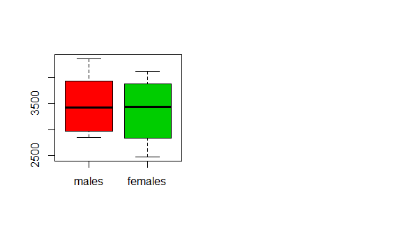
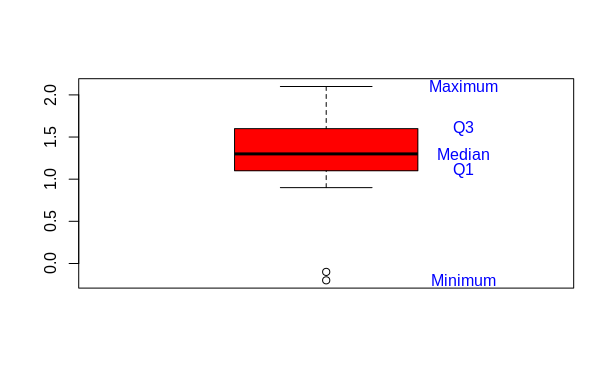

# 1 Descriptive Statistics
## 1.1 Infant birth weight

> In a study of different occupational groups the infant birth weight was recorded for randomly selected babies born by hairdressers, who had their first child. The following table shows the weight in grams (observations specified in sorted order) for 10 female births and 10 male births:

Gender |Weights|
------------ | ------------- | 
Famles(x)| 2474 2547 2830 3219 3429 3448 3677 3872 4001 4116  |
Males(y) | 2844 2863 2963 3239 3379 3449 3582 3926 4151 4356  |

> Solve at least the following questions a)-c) first “manually” and then by the inbuilt functions in . It is OK to use as alternative to your pocket calculator for the “manual” part, but avoid the inbuilt functions that will produce the results without forcing you to think about how to compute it during the manual part.

### a) Females
> What is the sample mean, variance and standard deviation of the female births? Express in your own words the story told by these numbers. The idea is to force you to interpret what can be learned from these numbers.

- **sample mean** - show average including outliers  


$$
\bar{x} = \frac{2474+2547+2830+3219+3429+3448+3677+3872+4001+4116}{10} \\ =  3361.3
$$

- **variance** - it’s the average of the distance of values from the mean squared

$$
s^2 = \frac{((2474-3361.3)^2+(2547-3361.3)^2+ 
                      (2830-3361.3)^2+\\(3219-3361.3)^2+
                      (3429-3361.3)^2+(3448-3361.3)^2+\\
                      (3677-3361.3)^2+(3872-3361.3)^2+
                      (4001-3361.3)^2+\\(4116-3361.3)^2}{9} = 344920.5
$$

- **standard deviation** - it's the square root of the variance. 

$$
s = \sqrt{283158.2} = 587.2993
$$


### b) Males
> Compute the same summary statistics of the male births. Compare and explain differences with the results for the female births.

- **sample mean**


$$
\bar{x} = \frac{2844+2863+ 2963+3239+ 3379+ 3449+ 3582+ 3926+ 4151+ 4356}{10} = 3475.2
$$

- **variance** 

$$
s^2 = \frac{(2844-3475.2)^2+(2863-3475.2)^2+ (2963-3475.2)^2+ \\
                    (3239-3475.2)^2+ (3379-3475.2)^2+ (3449-3475.2)^2+\\
                    (3582-3475.2)^2+ (3926-3475.2)^2+ (4151-3475.2)^2+ 
                    (4356-3475.2)^2}{9} =  532.1261
$$

- **standard deviation**  

$$
s = \sqrt{1625049} = 532.1261
$$

- Compared with females males infant is heavier with 113.9 in average. Moreover males weight varies 55.1732‬ grams less than females. 

### c) The five quartiles
> Find the five quartiles for each sample — and draw the two box plots with pen and paper (i.e. not using R)

- Females

$$
Q_{0} = q_{0} = x_{1} = 2474\\
Q_{1} = q_{0.25}= x_{25*\frac{10}{100} = x_{\lceil{2.5}\rceil}} = x_{3} = 2830 \\
Q_{2} = q_{0.50}= \frac{x_{5}+ x_{6}}{2} = \frac{3429+3448}{2} = 3438.5  \\
Q_{3} = q_{0.75} = x_{75*\frac{10}{100}} = x_{{\lceil{7.5}\rceil}} = x_{8} = 3872 \\
Q_{4} = q_{1} = x_{10} = 4116\\
$$


- Males


$$
Q_{0} = q_{0} = x_{1} = 2844\\
Q_{1} = q_{0.25}= x_{25*\frac{10}{100}} = x_{\lceil{2.5}\rceil} = x_{3} = 2963 \\
Q_{2} = q_{0.50}= \frac{x_{5}+ x_{6}}{2} = \frac{3379+3449}{2} = 3414.5  \\
Q_{3} = q_{0.75} = x_{75*\frac{10}{100}} = x_{{\lceil{7.5}\rceil}} = x_{8} = 3926 \\
Q_{4} = q_{1} = x_{10} = 4356\\
$$

- Boxplot:

  
  
### d) Inter Quartile Range(IQR)
> Are there any “extreme” observations in the two samples (use the modified box plot definition of extremness)?

$$
  IQR = q_{0.75} - q_{0.25} = Q_{3}-Q_{1}
$$

- Females 

$$
IQR = q_{0.75}- q_{0.25} = 3872 - 2830 = 1042 \\
\text{extremes} < Q_{1} - 1042 * 1.5 = 2963 - 1563 = 1400 \\
\text{OR} \\
\text{extremes} > Q_{3} + 1042 * 1.5 = 3872 + 1563 = 5435
$$

 There are no observations lower than 1400 or higher than 5435, so there are no  "extreme" observations

- Males 

$$
IQR = q_{0.75}- q_{0.25} =3926 - 2963  = 963 \\
\text{extremes} < Q_{1} - 963  * 1.5 = 2963 - 1444.5= 1518.5 \\
\text{OR} \\
\text{extremes} > Q_{3} + * 1.5 = 3926 + 1444.5  = 5370.5
$$

 There are no observations lower than 1518.5 or higher than 5370.5 , so there are no  "extreme" observations. 


### e) The coefficient of variations
> What are the coefficient of variations in the two groups?

$$
V = \frac{s}{\bar{x}}
$$

- Females 
$$
V = \frac{587.2993}{3361.1}= 0.1747
$$

- Males

$$
V = \frac{532.1261}{3475.2} = 0.153121
$$

## 1.2 Course grades
> To compare the difficulty of 2 different courses at a university the following grades distributions (given as number of pupils who achieved the grades) were registered:

Grade | Course 1 | Course 2 | Total |
------------ |------------ |------------ |------------ |
Grade 12 | 20 | 14 | 34|
Grade 10 | 14 | 14 |28|
Grade 7 | 16 | 27 | 43|
Grade 4 | 20 | 22 | 42|
Grade 2 | 12 | 27 |39|
Grade 0 |16 | 17 |33|
Grade 12 | 10 | 22 | 32|

### a) Median
> What is the median of the 251 achieved grades?

4
### b) Quartiles and IQR
> What are the quartiles and the IQR (Inter Quartile Range)?

$$
Q_{0} = q_{0} = x_{1} = -3\\
Q_{1} = q_{0.25}= x_{25*\frac{251}{100} = x_{\lceil{62.75}\rceil}} = x_{63} = 0 \\
Q_{2} = q_{0.50}= \frac{x_{125}+ x_{126}}{2} = \frac{4+4}{2} = 4  \\
Q_{3} = q_{0.75} = x_{75*\frac{251}{100}} = x_{{\lceil{188.25}\rceil}} = x_{189} = 7 \\
Q_{4} = q_{1} = x_{10} = 12\\ 
IQR = q_{0.75}- q_{0.25} = 7 - 0  = 7  \\
$$

## 1.3 Cholesterol
> In a clinical trial of a cholesterol-lowering agent, 15 patients’ cholesterol (in mmol $L^{-1}$ ) was measured before treatment and 3 weeks after starting treatment. Data is listed in the following table:

Patient No. | Before | After |
--- | --- | -- |
1 | 9.1 | 8.2 |   
2 | 8.0 | 6.4 |
3 | 7.7 | 6.6 |
4 | 10.0 | 8.5 |
5 | 9.6 | 8.0 |
6 | 7.9 | 5.8 |
7| 9.0 | 7.8 |
8 | 7.1 | 7.2 |
9 | 8.3 | 6.7 | 
10 | 9.6 | 9.8| 
11 | 8.2 | 7.1 |
12| 9.2 | 7.7 |
13 | 7.3 | 6.0 |
14 | 8.5 | 6.6 |
15 | 9.5 | 8.4 |

### a) Medians

> What is the median of the cholesterol measurements for the patients before treatment, and similarly after treatment?

$$
\bar{b} = 8.5 \\
\bar{a} = 7.2
$$

### b) Standard deviation
> Find the standard deviations of the cholesterol measurements of the patients before and after treatment.

$$
s_{b} = 0.9023778 \\
s_{a} = 1.090129
$$

### c) Sample covariance
> Find the sample covariance between cholesterol measurements of the patients before and after treatment.

**By Definition 1.18**

$$
s_{ab} = \frac{1}{n-1}\sum_{i=1}^{n}{(b_{i}-\bar{b})(a_{i}-\bar{a})} = 0.7964286
$$

### d) Correlation
> Find the sample correlation between cholesterol measurements of the patients before and after treatment.

$$
r = \frac{s_{ba}}{s_{b}*s_{a}} = 0.8096188
$$

### e) Differences
> Compute the 15 differences (Dif = Before − After) and do various summary statistics and plotting of these: sample mean, sample variance, sample standard deviation, boxplot etc.



```r
before <- c(9.1, 8.0, 7.7, 10.0, 9.6, 7.9, 9.0, 7.1, 8.3, 9.6,
            8.2, 9.2, 7.3, 8.5, 9.5)
after <- c(8.2, 6.4, 6.6, 8.5, 8.0, 5.8, 7.8, 7.2, 6.7, 9.8,
           7.1, 7.7, 6.0, 6.6, 8.4)
diffBeforeAfter <- before - after
mean(diffBeforeAfter)
median(diffBeforeAfter)
var(diffBeforeAfter)
sd(diffBeforeAfter)
quantile(diffBeforeAfter) # precentiles
boxplot(diffBeforeAfter, col = "red")
text(1.3, quantile(diffBeforeAfter), c("Minimum","Q1","Median","Q3","Maximum"),
     col="blue")
```

### f) Formal answer

> Observing such data the big question is whether an average decrease in cholesterol level can be “shown statistically”. How to formally answer this question is presented in Chapter 3, but consider now which summary statistics and/or plots would you look at to have some idea of what the answer will be?

I would answer something like this: the most patients decreased cholesterol level between 1.1 and 1.6, which is Inner Quartile Range (IQR). However the worst result recorded is -0.2 and the best is 2.1.  Lastly the mean is 1.21 and the median is 1.3. 


