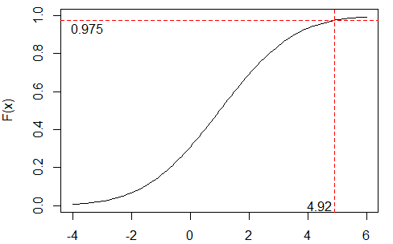
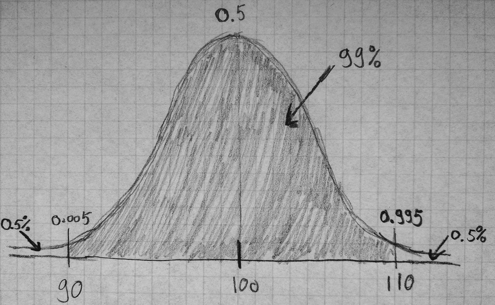

### 2.1 Discrete random variable

#### a) 

> Let X be a stochastic variable. When running the R-command `dbinom(4,10,0.6)` R returns 0.1115, written as:

- Binomial distribution is applied
- Shows the density or probability of 4 successes in 10 trails with each probability 0.6 

#### b)

$$
P(X\leqslant5) = 0.3669\\
P(X < 5 ) = 0.1662 \\
P(X>4) = 1 - P(X < 5 ) = 1 - 0.1662 = 0.8338\\
P(X = 5) = P(X\leqslant5) - P(X < 5 )  = 0.3669 - 0.1662 =  0.2007
$$


#### c ) 

- Poisson distribution
- The probability of 4 events to happen with rate 3 in given interval. 

#### d) 
$$
P(X\leqslant5) = 0.9161 \\
P(X < 5 ) = 0.8153 \\
P(X>4) = 1 - P(X < 5 ) = 1 - 0.8153 = 0.1847 \\
P(X = 5) = P(X\leqslant5) - P(X < 5 )  = 0.9161 - 0.8153 = 0.1008
$$

### Exercise 2.4

- Hypergeometric distribution
- 0 - the desired number of successes (discrepancies)
- 6 - total number of successes (discrepancies) in the population
- 14 - total number of not discrepancies
- 3 - tries without replacement 

```R
> dhyper(0,6, 14, 3)
[1] 0.3192982
```

### Exercise 2.5

- Hypergeometric distribution
- n  = 3  - draws without replacement 
- a = 2 - the number of successes in the large population
- N = 20 - elements in the large population 

#### a)

$$
\mu = n \frac{a}{N}= 3 * \frac{2}{20} = 0.3 \\
\sigma = n \frac{a(N-a)}{N^2}*\frac{N-n}{N-1} = 1.216 \\
P(X \geqslant 1 ) = 1 - P(X = 0) = 1 - 0.7157 = 0.2843
$$


#### b)

The difference from a) is that in a) we picked only 3 from 20 and needed to find probability only in this amount, but here we have probability of event and number of events. 

```R
> dbinom(0,10,0.01)
[1] 0.9043821
> dbinom(0,10,0.1)
[1] 0.3486784
```

### Exercise 2.7
> Poisson distribution

#### a)


$$
x = 5 \\
\lambda^{min} = 1.6 \\
P(X=5) = \frac{\lambda^x}{x!}*e^{-\lambda}  = 0.0176
$$

```R
>   dpois(5, 1.6)
[1] 0.01764199
```

#### b)

$$
\lambda^{5min} = \lambda{min} * 5 = 1.6 * 5 = 8 \\
P(X \leqslant 8) =  0.5925473
$$

```R
>   ppois(8, 8)
[1] 0.5925473
```

### Exercise 2.8

#### a)

$$
\lambda^{5min}=\frac{\lambda^{60min}}{12}=\frac{180}{12}= 15 \\
P(X>20) = 1 - P(X\leqslant20) = 1 - 0.8752188 = 0.1247812
$$

```R
> ppois(19, 15)
[1] 0.8752188
```

#### b)

$$
\lambda^{5min} = 15
$$

```R
> ppois(24:26, 15)
[1] 0.9888352 0.9938151 0.9966881
```

- There is 0.993 probability that there will be up to 25 calls for a randomly selected period of 5 minutes. Therefore the capacity should be 25 calls per 5 minutes.


### Exercise 2.9

#### a)

- Normal distribution

- `pnorm(2)` shows `cdf` for standard normal distribution: 
$$
Z \sim  N(0,1) \\
\text{,where }  \mu = 0 , \sigma^2 = 1\\
F(2) =  0.9772
$$


- `pnorm(2,1,1)` shows `cdf` for X:

$$
X \sim N(1,1)\\
\text{,where }  \mu = 1 , \sigma^2 = 1\\
F(2) = 0.8413
$$


- `pnorm(2,1,2)` shows `cdf` for Y:

$$
Y \sim N(1,4)\\
\text{,where }  \mu = 1 , \sigma^2 = 4\\
F(2) = 0.6915
$$


Note that the graph has been scaled. 

#### b) 

> What is the result of the following command: `qnorm(pnorm(2))`?

`pnorm` gives "a distance" up to **F(2)**, which is 0.9772499. We can use "that distance"  in `qnorm` function to find a value again, which is 2.  (See Figure 2.2 in the book for more)

```r
> pnorm(2)
[1] 0.9772499
> qnorm(pnorm(2))
[1] 2
```

#### c) 

> State what the numbers represent in the three cases.

- First case

```R
qnorm(0.975)
[1] 1.96
```
N(0,1) has the 97,5% quantile at x=1.96


- Second case

```r
qnorm(0.975,1,1)
[1] 2.96
```
N(1,1) has the 97,5% quantile at x=2.96


- Third case

```r
qnorm(0.975,1,2)
[1] 4.92
```
N(1,4) has the 97,5% quantile at x=4.92


### 2.10 The normal pdf
#### a)
> Which of the following statements regarding the probability density function
of the normal distribution N(1, 2^2) is false?

1. The total area under the curve is equal to 1.0
2. The mean is equal to 1^2
3. ~~The variance is equal to 2~~. Variance is equal to 4, because standard deviation is equal to 2:

$$
N(\mu, \sigma^2) \\
\sigma \text{- standart deviation} \\
\sigma^2 \text{- variance}
$$

4. The curve is symmetric about the mean.
5. The two tails of the curve extend indefinitely.

#### b)

> Let X be normally distributed with mean 24 and variance 16. Calculate the following probabilities:

$$
P(X\leqslant20) = 0.1586553
$$

```R
>   pnorm(20, mean=24, sd=sqrt(16) )
[1] 0.1586553
```


$$
P(X>29.5) = 1 - P(X\leqslant29.5) = 0.08456572
$$

```R
>  1 - pnorm(29.5, mean=24, sd=sqrt(16) )
[1] 0.08456572
```


$$
P(X=23.8) = 0.09961098
$$

```R
> dnorm(23.8, mean=24, sd=sqrt(16))
[1] 0.09961098
```

### 2.11 Computer chip control
> A machine for checking computer chips uses on average 65 milliseconds per
check with a standard deviation of 4 milliseconds. A newer machine, potentially
to be bought, uses on average 54 milliseconds per check with a standard
deviation of 3 milliseconds. It can be used that check times can be assumed
normally distributed and independent.

#### a)
> What is the probability that the time savings per check using the new machine
is less than 10 milliseconds is?

By theorem 2.40 and example 2.41:

$$
X \sim N(65,16) \\ 
Y \sim N(54,9)  \\
Z = X - Y \\
\mu_{Z} =\mu_{X} - \mu_{Y} = 65-54=11 \\
\sigma^2_{Z} = \sigma^2_{X}+\sigma^2_{Y}= 16+9=25\\
Z\sim N(11,25)\\
P(Z\leqslant10)=0.4207403
$$

```R
> pnorm(10, 11,sqrt(25))
[1] 0.4207403
```

Note that it does not matter in continuous distributions if we use $<$ or $\leqslant$ in order to define the probability. 

#### b)

> What is the mean and standard deviation for the total time use for
> checking 100 chips on the new machine is?

By theorem 2.56:

$$
Y \sim N(54,9) \\
\mu_{Z}= 100*E(X)= 100*54= 5400 \\
\sigma_{Z} = \sqrt{V(100X)} = \sqrt{100*9} = 30
$$

### 2.12 Concrete items 
> A manufacturer of concrete items knows that the length (L) of his items are reasonably
normally distributed with muL = 3000 mm and sigmaL = 3 mm. The requirement
for these elements is that the length should be not more than 3007 mm
and the length must be at least 2993 mm.

#### a)
> The expected error rate in the manufacturing will be?

- The expected error rate is the probability of manufacturing an item shorter than 2993 and longer than 3007, so:

$$
L \sim (3000, 9)\\
$$

$$
P(L>3007) = 1 - P(L<3007) \\
$$

$$
P(2993>L>3007) = P(L>3007) + P(L<2993) = \\ 
(1 - P(L<3007)) + P(L<2993)  = \\
(1-0.9901847) +  0.009815329 = 0.01963066
$$


```R
> pnorm(3007,mean=3000, sd=sqrt(9))
[1] 0.9901847
> pnorm(2993,mean=3000, sd=sqrt(9))
[1] 0.009815329
```

#### b)

> The concrete items are supported by beams, where the distance between
> the beams is called Lbeam and can be assumed normal distributed. The
> concrete items length is still called L. For the items to be supported correctly,
> the following requirements for these lengths must be fulfilled: 90mm <
> L - Lbeam < 110 mm. It is assumed that the mean of the distance between
> the beams is mbeam = 2900 mm. How large may the standard deviation
> sigmabeam of the distance between the beams be if you want the requirement
> fulfilled in 99% of the cases?

- Find:

$$
\sigma_{beam}
$$

- Needs be fulfilled:

$$
P(90<L-L_{beam}<110) = 0.99
$$

- We know:

$$
L\sim(3000,9)\\
L_{beam} \sim (2900, \sigma^2_{beam}) \\
\mu_{L-L_{beam}}=\mu_{L}-\mu_{beam}=3000-2900=100\\ 
\sigma_{L-L_{beam}}=\sqrt{9+\sigma^2_{beam}}\\
$$

- We can draw a graph like this, because 99% of all distances should between 90 and 110. So there is only 0.5% left in each side, that the 0.005 quantile is at 90 and the 0.995 quantile is at 110:

{: style="width:400px;display:block;margin-left:auto;margin-right:auto;"}

- We can also write this like following: 

$$
P(90<L-L_{beam}<110) = P(L-L_{beam}<110) - P(L-L_{beam}<90) \\
P(L-L_{beam}<110) = 0.995 \\
P(L-L_{beam}<90) = 0.005 \\
$$


- We can use theorem 2.43 in order to find a standard deviation of the distance, because the value of the standardized normal random variable at 0.005 quantile should be equal to the transformed distance variable:

$$
z_{0.005} = \frac{90-100}{\sqrt{9+\sigma^2_{beam}}}
$$


- And the same at 0.995 quantile:
  
$$
z_{0.995} = \frac{110-100}{\sqrt{9+\sigma^2_{beam}}}
$$

- We choose the second equation:

$$
z_{0.995}= 2.575829 \\
2.575829 = \frac{110-100}{\sqrt{9+\sigma^2_{beam}}}
$$


```R
> qnorm(0.995)
[1] 2.575829
```

- So the result is:

$$
\sigma_{beam} = 2.464107
$$

 

### 2.13 Online statistic video views

> In 2013, there were 110,000 views of the DTU statistics videos that are available online. Assume first that the occurrence of views through 2014 follows a Poisson process with a 2013 average: $\lambda_{365days} = 110000$.

#### a)

> What is the probability that in a randomly chosen half an hour there is no
> occurrence of views?

Here we can use either Exponential distribution or Poisson to find the probability.  
- Poisson distribution  

$$
\lambda_{30min}= \frac{110000*30}{365*24*60} = 6.278539  \\
X \sim Po(\lambda_{30min}= 6.278539 ) \\
P(X=0) = 0.00187614
$$

```R
> dpois(x=0,  lambda=6.278539 )
[1] 0.00187614
```

- Exponential distribution

$$
X \sim Exp(\lambda_{365days}=110000) \\
$$

0 event between now and 30 min is given by:
$$
P(X>\frac{30}{365*24*60}) =
$$

or can be written as 1 minus the probability of occurring next event between now and 30min
$$
= 1 - P(X\leqslant\frac{30}{365*24*60}) = 0.00187614
$$


```R
> 1-pexp(q=30/(365*24*60), rate = 110000)
[1] 0.00187614
```


#### b)

> There has just been a view, what is the probability that you have to wait more than fifteen minutes for the next view?

- 0 events between now and 15min is given by:

$$
P(X>\frac{15}{365*24*60}) = \\
1 - P(X\leqslant\frac{15}{365*24*60}) = 0.04331443
$$


```R
> 1-pexp(q=15/(365*24*60), rate = 110000)
[1] 0.04331443
```


<!-- https://nicolewhite.github.io/2015/05/23/understanding-waiting-times.html -->

<!-- https://towardsdatascience.com/what-is-exponential-distribution-7bdd08590e2a -->

