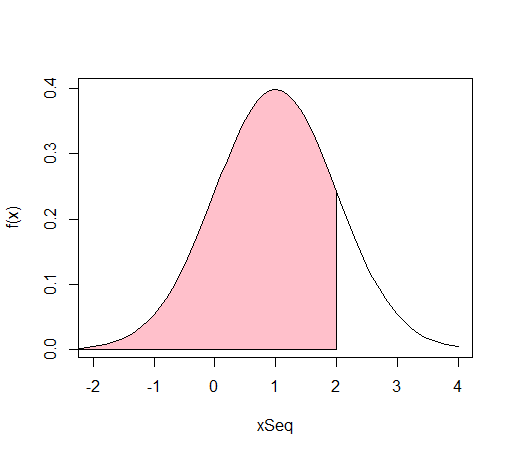
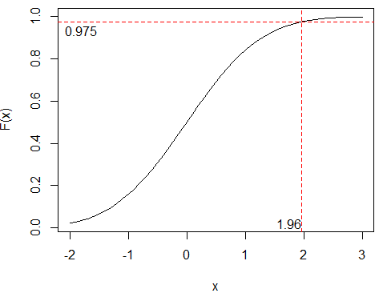

### Exercise 2.1

#### a) 

- Binomial distribution is applied
- Shows the density or probability of 4 successes in 10 trails with each probability 0.6 

#### b)

$$
P(X\leqslant5) = 0.3669\\
P(X < 5 ) = 0.1662 \\
P(X>4) = 1 - P(X < 5 ) = 1 - 0.1662 = 0.8338\\
P(X = 5) = P(X\leqslant5) - P(X < 5 )  = 0.3669 - 0.1662 =  0.2007
$$


#### c ) 

- Poisson distribution
- The probability of 4 events to happen with rate 3 in given interval. 

#### d) 
$$
P(X\leqslant5) = 0.9161 \\
P(X < 5 ) = 0.8153 \\
P(X>4) = 1 - P(X < 5 ) = 1 - 0.8153 = 0.1847 \\
P(X = 5) = P(X\leqslant5) - P(X < 5 )  = 0.9161 - 0.8153 = 0.1008
$$

### Exercise 2.4

- Hypergeometric distribution
- 0 - the desired number of successes (discrepancies)
- 6 - total number of successes (discrepancies) in the population
- 14 - total number of not discrepancies
- 3 - tries without replacement 

```R
> dhyper(0,6, 14, 3)
[1] 0.3192982
```

### Exercise 2.5

- Hypergeometric distribution
- n  = 3  - draws without replacement 
- a = 2 - the number of successes in the large population
- N = 20 - elements in the large population 

#### a)

$$
\mu = n \frac{a}{N}= 3 * \frac{2}{20} = 0.3 \\
\sigma = n \frac{a(N-a)}{N^2}*\frac{N-n}{N-1} = 1.216 \\
P(X \geqslant 1 ) = 1 - P(X = 0) = 1 - 0.7157 = 0.2843
$$


#### b)

The difference from a) is that in a) we picked only 3 from 20 and needed to find probability only in this amount, but here we have probability of event and number of events. 

```R
> dbinom(0,10,0.01)
[1] 0.9043821
> dbinom(0,10,0.1)
[1] 0.3486784
```

### Exercise 2.7
> Poisson distribution

#### a)


$$
x = 5 \\
\lambda^{min} = 1.6 \\
P(X=5) = \frac{\lambda^x}{x!}*e^{-\lambda}  = 0.0176
$$

```R
>   dpois(5, 1.6)
[1] 0.01764199
```

#### b)

$$
\lambda^{5min} = \lambda{min} * 5 = 1.6 * 5 = 8 \\
P(X \leqslant 8) =  0.5925473
$$

```R
>   ppois(8, 8)
[1] 0.5925473
```

### Exercise 2.8

#### a)

$$
\lambda^{5min}=\frac{\lambda^{60min}}{12}=\frac{180}{12}= 15 \\
P(X>20) = 1 - P(X\leqslant20) = 1 - 0.8752188 = 0.1247812
$$

```R
> ppois(19, 15)
[1] 0.8752188
```

#### b)

$$
\lambda^{5min} = 15
$$

```R
> ppois(24:26, 15)
[1] 0.9888352 0.9938151 0.9966881
```

- There is 0.993 probability that there will be up to 25 calls for a randomly selected period of 5 minutes. Therefore the capacity should be 25 calls per 5 minutes.


### Exercise 2.9

#### a)

- Normal distribution

- `pnorm(2)` shows `cdf` for standard normal distribution: 
$$
Z \sim  N(0,1) \\
\text{,where }  \mu = 0 , \sigma^2 = 1\\
F(2) =  0.9772
$$


- `pnorm(2,1,1)` shows `cdf` for X:

$$
X \sim N(1,1)\\
\text{,where }  \mu = 1 , \sigma^2 = 1\\
F(2) = 0.8413
$$



- `pnorm(2,1,2)` shows `cdf` for Y:

$$
Y \sim N(1,4)\\
\text{,where }  \mu = 1 , \sigma^2 = 4\\
F(2) = 0.6915
$$


#### b) 

> What is the result of the following command: `qnorm(pnorm(2))`?

`pnorm` gives "a distance" up to **F(2)**, which is 0.9772499. We can use "that distance"  in `qnorm` function to find a value again, which is 2.  (See Figure 2.2 in the book for more)

```r
> pnorm(2)
[1] 0.9772499
> qnorm(pnorm(2))
[1] 2
```

#### c) 

> State what the numbers represent in the three cases.

- First case

```R
qnorm(0.975)
[1] 1.96
```
N(0,1) has the 97,5% quantile at x=1.96


- Second case

```r
qnorm(0.975,1,1)
[1] 2.96
```
N(1,1) has the 97,5% quantile at x=2.96


- Third case

```r
qnorm(0.975,1,2)
[1] 4.92
```
N(1,4) has the 97,5% quantile at x=4.92
