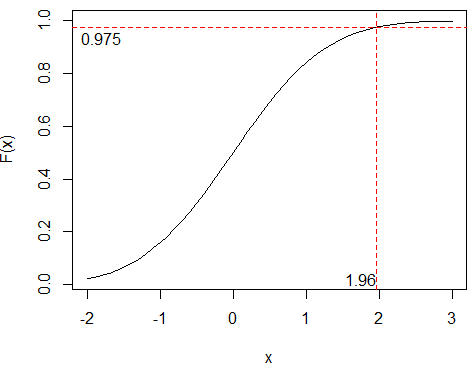
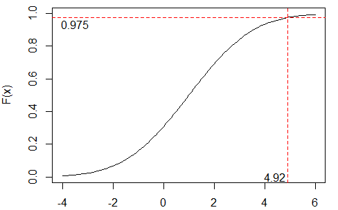

# 2 Probability: Continuous
## 2.9 Continuous random variable
### a)
> The following R commands and results are given:
```R
pnorm(2)
[1] 0.9772
pnorm(2,1,1)
[1] 0.8413
pnorm(2,1,2)
[1] 0.6915
```
> Specify which distributionsare used and explain the resulting probabili-
> ties (preferably by a sketch).

- Normal distribution

- `pnorm(2)` shows `cdf` for standard normal distribution: 
$$
Z \sim  N(0,1) \\
\text{,where }  \mu = 0 , \sigma^2 = 1\\
F(2) =  0.9772
$$


- `pnorm(2,1,1)` shows `cdf` for X:

$$
X \sim N(1,1)\\
\text{,where }  \mu = 1 , \sigma^2 = 1\\
F(2) = 0.8413
$$


- `pnorm(2,1,2)` shows `cdf` for Y:

$$
Y \sim N(1,4)\\
\text{,where }  \mu = 1 , \sigma^2 = 4\\
F(2) = 0.6915
$$


Note that the graph has been scaled. 

### b) 

> What is the result of the following command: `qnorm(pnorm(2))`?

`pnorm` gives "a distance" up to **F(2)**, which is 0.9772499. We can use "that distance"  in `qnorm` function to find a value again, which is 2.  (See Figure 2.2 in the book for more)

```r
> pnorm(2)
[1] 0.9772499
> qnorm(pnorm(2))
[1] 2
```

### c) 

> State what the numbers represent in the three cases.

- First case

```R
qnorm(0.975)
[1] 1.96
```
N(0,1) has the 97,5% quantile at x=1.96


- Second case

```r
qnorm(0.975,1,1)
[1] 2.96
```
N(1,1) has the 97,5% quantile at x=2.96


- Third case

```r
qnorm(0.975,1,2)
[1] 4.92
```
N(1,4) has the 97,5% quantile at x=4.92


## 2.10 The normal pdf
### a)
> Which of the following statements regarding the probability density function
> of the normal distribution $N(1, 2^2)$ is false?

 1. The total area under the curve is equal to 1.0
 2. The mean is equal to 1^2
 3. The variance is equal to 2. 
 4. The curve is symmetric about the mean.
 5. The two tails of the curve extend indefinitely.


**Answer**: 3 is false. Variance is equal to 4, because the standard deviation is equal to 2:

$$
N(1,2^2) \text{,where }N(\mu, \sigma^2) \\
\sigma \text{- standart deviation} \\
\sigma^2 \text{- variance}
$$

### b)

> Let X be normally distributed with mean 24 and variance 16. Calculate the following probabilities:

$$
P(X\leqslant20) = 0.1586553
$$

```R
>   pnorm(20, mean=24, sd=sqrt(16) )
[1] 0.1586553
```


$$
P(X>29.5) = 1 - P(X\leqslant29.5) = 0.08456572
$$

```R
>  1 - pnorm(29.5, mean=24, sd=sqrt(16) )
[1] 0.08456572
```


$$
P(X=23.8) = 0.09961098
$$

```R
> dnorm(23.8, mean=24, sd=sqrt(16))
[1] 0.09961098
```

## 2.11 Computer chip control
> A machine for checking computer chips uses on average 65 milliseconds per check with a standard deviation of 4 milliseconds. A newer machine, potentially to be bought, uses on average 54 milliseconds per check with a standard deviation of 3 milliseconds. It can be used that check times can be assumed normally distributed and independent.

### a)
> What is the probability that the time savings per check using the new machine is less than 10 milliseconds is?

By theorem 2.40 and example 2.41:

$$
X \sim N(65,16) \\ 
Y \sim N(54,9)  \\
Z = X - Y \\
\mu_{Z} =\mu_{X} - \mu_{Y} = 65-54=11 \\
\sigma^2_{Z} = \sigma^2_{X}+\sigma^2_{Y}= 16+9=25\\
Z\sim N(11,25)\\
P(Z\leqslant10)=0.4207403
$$

```R
> pnorm(10, 11,sqrt(25))
[1] 0.4207403
```

Note that it does not matter in continuous distributions if we use $<$ or $\leqslant$ in order to define the probability. 

### b)

> What is the mean and standard deviation for the total time use for
> checking 100 chips on the new machine is?

By theorem 2.56:

$$
Y \sim N(54,9) \\
\mu_{Z}= 100*E(X)= 100*54= 5400 \\
\sigma_{Z} = \sqrt{V(100X)} = \sqrt{100*9} = 30
$$

## 2.12 Concrete items 
> A manufacturer of concrete items knows that the length (L) of his items are reasonably normally distributed with $\mu_{L}$ = 3000 mm and $\sigma_{L}$ = 3 mm. The requirement for these elements is that the length should be not more than 3007 mm and the length must be at least 2993 mm.

### a)
> The expected error rate in the manufacturing will be?

- The expected error rate is the probability of manufacturing an item shorter than 2993 and longer than 3007, so:

$$
L \sim (3000, 9)\\
$$

$$
P(L>3007) = 1 - P(L<3007) \\
$$

$$
P(2993>L>3007) = P(L>3007) + P(L<2993) = \\ 
(1 - P(L<3007)) + P(L<2993)  = \\
(1-0.9901847) +  0.009815329 = 0.01963066
$$


```R
> pnorm(3007,mean=3000, sd=sqrt(9))
[1] 0.9901847
> pnorm(2993,mean=3000, sd=sqrt(9))
[1] 0.009815329
```

### b)

> The concrete items are supported by beams, where the distance between the beams is called $L_{beam}$ and can be assumed normal distributed. The concrete items length is still called $L$. For the items to be supported correctly, the following requirements for these lengths must be fulfilled: 90mm < $L - L_{beam}$ < 110 mm. It is assumed that the mean of the distance between the beams is $\mu_{beam}$ = 2900 mm. How large may the standard deviation $\sigma_{beam}$ of the distance between the beams be if you want the requirement fulfilled in 99% of the cases?

- Find:

$$
\sigma_{beam}
$$

- Needs be fulfilled:

$$
P(90<L-L_{beam}<110) = 0.99
$$

- We know:

$$
L\sim(3000,9)\\
L_{beam} \sim (2900, \sigma^2_{beam}) \\
\mu_{L-L_{beam}}=\mu_{L}-\mu_{beam}=3000-2900=100\\ 
\sigma_{L-L_{beam}}=\sqrt{9+\sigma^2_{beam}}\\
$$

- We can draw a graph like this, because 99% of all distances should between 90 and 110. So there is only 0.5% left in each side, that the 0.005 quantile is at 90 and the 0.995 quantile is at 110:

{: style="width:400px;display:block;margin-left:auto;margin-right:auto;"}

- We can also write this like following: 

$$
P(90<L-L_{beam}<110) = P(L-L_{beam}<110) - P(L-L_{beam}<90) \\
P(L-L_{beam}<110) = 0.995 \\
P(L-L_{beam}<90) = 0.005 \\
$$


- We can use theorem 2.43 in order to find a standard deviation of the distance, because the value of the standardized normal random variable at 0.005 quantile should be equal to the transformed distance variable:

$$
z_{0.005} = \frac{90-100}{\sqrt{9+\sigma^2_{beam}}}
$$


- And the same at 0.995 quantile:
  
$$
z_{0.995} = \frac{110-100}{\sqrt{9+\sigma^2_{beam}}}
$$

- We choose the second equation:

$$
z_{0.995}= 2.575829 \\
2.575829 = \frac{110-100}{\sqrt{9+\sigma^2_{beam}}}
$$


```R
> qnorm(0.995)
[1] 2.575829
```

- So the result is:

$$
\sigma_{beam} = 2.464107
$$

 

## 2.13 Online statistic video views

> In 2013, there were 110,000 views of the DTU statistics videos that are available online. Assume first that the occurrence of views through 2014 follows a Poisson process with a 2013 average: $\lambda_{365days} = 110000$.

### a)

> What is the probability that in a randomly chosen half an hour there is no
> occurrence of views?

Here we can use either Exponential distribution or Poisson to find the probability.  
- Poisson distribution  

$$
\lambda_{30min}= \frac{110000*30}{365*24*60} = 6.278539  \\
X \sim Po(\lambda_{30min}= 6.278539 ) \\
P(X=0) = 0.00187614
$$

```R
> dpois(x=0,  lambda=6.278539 )
[1] 0.00187614
```

- Exponential distribution

$$
X \sim Exp(\lambda_{365days}=110000) \\
$$

0 event between now and 30 min is given by:
$$
P(X>\frac{30}{365*24*60}) =
$$

or can be written as 1 minus the probability of occurring next event between now and 30min
$$
= 1 - P(X\leqslant\frac{30}{365*24*60}) = 0.00187614
$$


```R
> 1-pexp(q=30/(365*24*60), rate = 110000)
[1] 0.00187614
```


### b)

> There has just been a view, what is the probability that you have to wait more than fifteen minutes for the next view?

- 0 events between now and 15min is given by:

$$
P(X>\frac{15}{365*24*60}) = \\
1 - P(X\leqslant\frac{15}{365*24*60}) = 0.04331443
$$


```R
> 1-pexp(q=15/(365*24*60), rate = 110000)
[1] 0.04331443
```


<!-- https://nicolewhite.github.io/2015/05/23/understanding-waiting-times.html -->

<!-- https://towardsdatascience.com/what-is-exponential-distribution-7bdd08590e2a -->