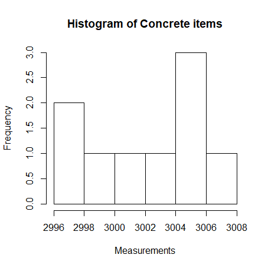
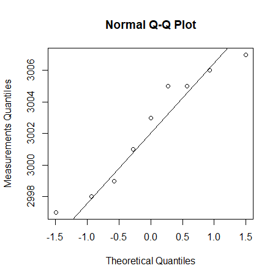
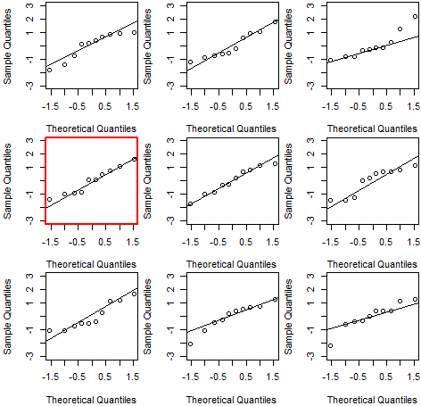

# 3 Hypothesis Testing

## 3.3 Concrete items
> A construction company receives concrete items for a construction. The length of the items are assumed reasonably normally distributed. The following requirements for the length of the elements are made $\mu=3000mm$. The company samples 9 items from a delivery which are then measured for control. The following measurements (in mm) are found: 3003, 3005, 2997, 3006, 2999, 2998, 3007, 3005, 3001.

### a)

> To investigate whether the requirement to the mean is fulfilled (with $\alpha= 5%$ ), the following hypothesis should be tested

$$
H_{0}:\ =\ 3000 \\
H_{1}:\ \neq\ 3000
$$

> Or similarly asked: what is the evidence against the null hypothesis?

We know that:

$$
\bar{x} = 3002.333 \\
s = 3.708099 \\
$$

**By using Method 3.36**

**1.**  
$$
t_{obs}= \frac{\bar{x}-\mu_{0}}{s/\sqrt{n}}=1.88749
$$

```R
> (3002.333-3000)/(3.708099/sqrt(9))
[1] 1.88749
```

**2.** 
$$
\text{p-value}= 2*P(T>|t_{obs}|) = 0.09579526
$$

```r
> 2*(1-pt(1.88749, df=8))
[1] 0.09579526
```

**3.  Conclusion:**

$\text{p-value}$ (0.096) is more than $\alpha$ (0.05), so we can accept $H_{0}$


Note that we can produce same result by using `t.test` in R

```R
> t.test(sample, mu=3000)

	One Sample t-test

data:  sample
t = 1.8878, df = 8, p-value = 0.09576
alternative hypothesis: true mean is not equal to 3000
95 percent confidence interval:
 2999.483 3005.184
sample estimates:
mean of x 
 3002.333 
```


### b) 

> What would the level $\alpha = 0.01 $ critical values be for this test, and what are the interpretation of these?

$$
t_{\alpha/2} = t_{0.005}= -3.355387  \\
t_{1-\alpha/2}= t_{0.995} = 3.355387
$$


```r
> qt(0.005, df=8)
[1] -3.355387
> qt(0.995, df=8)
[1] 3.355387
```

- We can reject $H_0$ if the observed test-statistics ($t_{obs}$) is more extreme than the calculated critical value with the significance level of $\alpha=0.01$

### c)

> What would the level $\alpha=0.05$  critical values be for this test (compare also with the values found in the previous question)?

$$
t_{\alpha/2} = t_{0.025}= -2.306004  \\
t_{1-\alpha/2}= t_{0.975} = 2.306004
$$


```R
> qt(0.05/2, df=8)
[1] -2.306004
> qt(1-0.05/2, df=8)
[1] 2.306004
```

- Critical values get closer to each other as the $\alpha$  increases.

### d) 

> Investigate, by some plots, whether the data here appears to be coming from a normal distribution (as assumed until now)?

```R
hist(sample, main = "Histogram of Concrete items", xlab= "Measurements")
```



```R
qqnorm(sample, ylab="Measurements Quantiles")
qqline(sample)
```



```R
qqwrap <- function(x, y, ...){
  stdy <- (y-mean(y))/sd(y)
  qqnorm(stdy, main="", ...)
  qqline(stdy)}

wallyplot(x-mean(sample), FUN=qqwrap, ylim=c(-3,3))
```



### e)

> Assuming that you, maybe among different plots, also did the normal q-q plot above, the question is now: What exactly is plotted in that plot? Or more specifically: what are the x- and y-coordinates of e.g. the two points to the lower left in this plot?

- X coordinates represent the expected normal quantiles. 
- Y coordinates represent the sample quantiles.

For example, the point $( 0, 3002.333 )$ represents respectively the 0.5 quantiles of the expected normal distribution and the sample.


## 3.4 Aluminum profile 

> The length of an aluminum profile is checked by taking a sample of 16 items whose length is measured. The measurement results from this sample are listed below, all measurements are in mm: 180.02, 180.00, 180.01, 179.97, 179.92, 180.05, 179.94, 180.10,180.24, 180.12, 180.13, 180.22, 179.96, 180.10, 179.96, 180.06 . From data is obtained: $\bar{x}=180.05 $ and $s = 0.0959$ . It can be assumed that the sample comes from a population which is normal distributed.


### a) 

> Find the evidence against the following hypothesis:

$$
H_{0}\ : =\ \mu=180
$$


```R
> t.test(aluminum, mu=180)

	One Sample t-test

data:  aluminum
t = 2.0851, df = 15, p-value = 0.05456
alternative hypothesis: true mean is not equal to 180
95 percent confidence interval:
 179.9989 180.1011
sample estimates:
mean of x 
   180.05 
```

$\text{p-value}$ (0.05452038) is more than 0.05, but less than 1, so there is a weak evidences against $H_{0}$.


### b)

> If the following hypothesis test is carried out

$$
H_{0}:\ \mu=180 \\
H_{1}:\ \mu\neq180
$$

> What are the level $\alpha= 1%$ critical values for this test?

$$
t_{\alpha/2} = t_{0.005}= -2.946713  \\
t_{1-\alpha/2}= t_{0.995} = 2.946713
$$

```r
> qt(0.005, df=16-1)
[1] -2.946713
> qt(0.995, df=16-1)
[1] 2.946713
```


### c)

> What is the 99%-confidence interval for $\mu$?


$$
\bar{x}\pm t_{0.995}* \frac{s}{\sqrt{n}} = 180.05 \pm 2.946713*\frac{0.0959}{\sqrt{16}} = \\
= 180.05 \pm 0.07064744 = [ 179.9794,  180.1206]
$$


```R
> qt(0.995,15)
[1] 2.946713
```


### d)

> Carry out the following hypothesis test using $\alpha=5\%$ 

$$
H_{0}:\ \mu=180 \\
H_{1}:\ \mu\neq180
$$

We know that:

$$
\bar{x} = 180.05  \\
s = 0.0959 \\
$$


**By using Method 3.36**

**1.**  
$$
t_{obs}= \frac{\bar{x}-\mu_{0}}{s/\sqrt{n}}= 2.085506
$$

```R
> (180.05-180)/(0.0959/sqrt(16))
[1] 2.085506
```

**2.** 
$$
\text{p-value}= 2*P(T>|t_{obs}|) = 0.05452038
$$

```r
> 2*(1-pt(2.085506, df=15))
[1] 0.05452038
```

**3.  Conclusion:**

$\text{p-value}$ (0.05452038) is more than $\alpha$ (0.05), so we can accept $H_{0}$.


```R
> t.test(aluminum, mu=180)

	One Sample t-test

data:  aluminum
t = 2.0851, df = 15, p-value = 0.05456
alternative hypothesis: true mean is not equal to 180
95 percent confidence interval:
 179.9989 180.1011
sample estimates:
mean of x 
   180.05 
```

$\text{p-value}$ (0.05452038) is more than 0.05, but less than 1, so there is weak evidences against $H_{0}$.