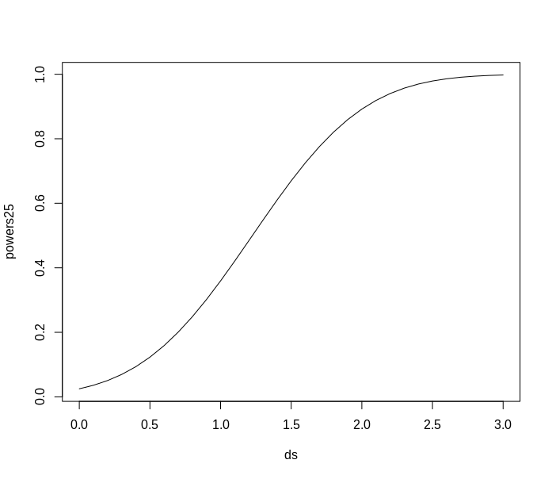
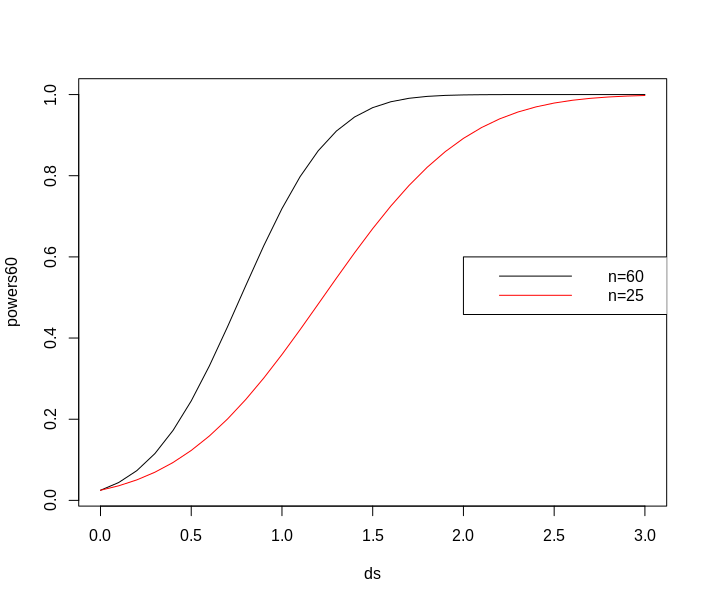

# 3 Sample Size and Statistical Power


## 3.5 Transport times


> A company, MM, selling items online wants to compare the transport times for two transport firms for delivery of the goods. To compare the two companies recordings of delivery times on a specific route were made, with a sample size of n = 9 for each firm. The following data were found:

$$
\text{Firm A: } \bar{y}_A = 1.93d \text{ and } s_A=0.45 d \\
\text{Firm B: } \bar{y}_B = 1.49d \text{ and } s_B=0.58 d
$$

> note that d is the SI unit for days. It is assumed that data can be regarded as stemming from normal distributions.


### a)

> We want to test the following hypothesis

$$
H_0:\mu_A=\mu_B \\
H_1: \mu_A \ne \mu_B
$$


> What is the p-value, interpretation and conclusion for this test (at α = 5% level)?

$\text{p-value} =  0.09221726$ is more than $\alpha=0.05$ , so we have to accept $H_0$, that means there is no significant difference between  for two transport firm for delivery of the goods.


```R
t.test2 <- function(m1,m2,s1,s2,n1,n2,m0=0,equal.variance=FALSE, conf.int=0.05)
{
  if( equal.variance==FALSE ) 
  {
    se <- sqrt( (s1^2/n1) + (s2^2/n2) )
    # welch-satterthwaite df
    df <- ( (s1^2/n1 + s2^2/n2)^2 )/( (s1^2/n1)^2/(n1-1) + (s2^2/n2)^2/(n2-1) )
  } else
  {
    # pooled standard deviation, scaled by the sample sizes
    se <- sqrt( (1/n1 + 1/n2) * ((n1-1)*s1^2 + (n2-1)*s2^2)/(n1+n2-2) ) 
    df <- n1+n2-2
  }      
  CI <- m1-m2 + c(-1,1)*qt(1-conf.int/2, df)*sqrt(s1^2/n1+s2^2/n2)
  t <- (m1-m2-m0)/se 
  dat <- c(m1-m2,df , se, t, 2*pt(-abs(t),df), CI)    
  names(dat) <- c("Difference of means", "df" , "Std Error", "t", "p-value", "CI low", "CI high")
  
  
  return(dat) 
}
> t.test2(m1=1.93, m2=1.49, s1=0.45, s2=0.58, n1=9, n2=9)
Difference of means  	0.44000000                 
df      				15.06964679        
Std Error      			0.24469936                
t             			1.79812484   
p-value                	0.09221726
CI low 					-0.08135448 
CI high  				0.96135448      
```


### b)

> Find the 95% confidence interval for the mean difference µA − µB.

From the output above:

$$
\bar{x}-\bar{y}\pm t_{1-\alpha/2}*\sqrt{\frac{s_{1}^2}{n_1}+\frac{s^2_{2}}{n_2}} = [-0.08135448,0.96135448]
$$

### c)

>  What is the power of a study with n = 9 observations in each of the two samples of detecting a potential mean difference of 0.4 between the firms (assume that σ = 0.5 and that we use α = 0.05)?

**Answer:** From the output below, we can see that the power is 0.358, which is basically the probability of correctly rejecting $H_0$ if $H_0$ is false. 

```r
> power.t.test(n=9, delta=0.4, sd=0.5, sig.level=0.05)

     Two-sample t test power calculation 

              n = 9
          delta = 0.4
             sd = 0.5
      sig.level = 0.05
          power = 0.357765
    alternative = two.sided

NOTE: n is number in *each* group
```


### d)

> What effect size (mean difference) could be detected with n = 9 observations in each of the two samples with a power of 0.8 (assume that σ = 0.5 and that we use α = 0.05)?

**Answer:** From the output below we can see, that 0.7 mean difference could be detected with given values. 

```R
> power.t.test(n=9, sd=0.5, sig.level=0.05, power=0.8)

     Two-sample t test power calculation 

              n = 9
          delta = 0.7034721
             sd = 0.5
      sig.level = 0.05
          power = 0.8
    alternative = two.sided

NOTE: n is number in *each* group
```


### e)

> How large a sample size (from each firm) would be needed in a new investigation, if we want to detect a potential mean difference of 0.4 between the firms with probability 0.90, that is with power=0.90 (assume that σ = 0.5 and that we use α = 0.05)?

**Answer:** From the output below we can see that we would be needed a sample size with 34 observations in a new investigation with given values.  

```R
> power.t.test(sd=0.5, sig.level=0.05, power=0.9, delta=0.4)

     Two-sample t test power calculation 

              n = 33.82555
          delta = 0.4
             sd = 0.5
      sig.level = 0.05
          power = 0.9
    alternative = two.sided

NOTE: n is number in *each* group
```


## 3.10 Concrete items

> A construction company receives concrete items for a construction. The length of the items are assumed reasonably normally distributed. The following requirements for the length of the elements are made $\mu=3000mm$. The company samples 9 items from a delivery which are then measured for control. The following measurements (in mm) are found: 3003, 3005, 2997, 3006, 2999, 2998, 3007, 3005, 3001.

### a)

> A study is planned of a new supplier. It is expected that the standard deviation will be approximately 3, that is, σ = 3 mm. We want a 90% confidence interval for the mean value in this new study to have a width of 2 mm. How many items should be sampled to achieve this?

$$
n= \left(\frac{z_{1-\alpha/2}*\sigma}{ME}\right)^2 = 24.34989
$$


```R
> (qnorm(1-0.1/2)*3/1)^2
[1] 24.34989
```

### b)

> Answer the sample size question above but requiring the 99% confidence interval to have the (same) width of 2 mm.

By increasing the confidence interval to 99%, we have to increase the sample size to 60. 

```R
> (qnorm(1-0.01/2)*3/1)^2
[1] 59.71407
```

### d)

> Now a new experiment is to be planned. In the first part above, given some wanted margin of error (ME) a sample size of n = 25 was found. What are each of the probabilities that an experiment with n = 25 will detect effects corresponding to (”end up significant for”) μ 1 = 3001, 3002, 3003
> respectively? Assume that we use the typical α = 0.05 level and that σ = 3?

**Answer** From the output below the three probabilities are 0.36, 0.89 and 0.998 for respectively 1, 2 and 3 deltas, which are found by 3001-3000=1 etc. 


```r
> power.t.test(sd=3, n = 25, sig.level=0.05, delta = 1:3, type="one.sample")

     One-sample t test power calculation 

              n = 25
          delta = 1, 2, 3
             sd = 3
      sig.level = 0.05
          power = 0.3594721, 0.8920169, 0.9976846
    alternative = two.sided
```

**Plot of powers with n=25**

```R
ds = seq(0, 3, 0.1)
powers25 <- power.t.test(n = 25, delta = ds, sd = 3, sig.level = 0.05,
type = c("one.sample"))$power
plot(ds, powers25, type = "l")
```




### e)

> One of the sample size computation above led to n = 60 (it is not so important how/why). Answer the same question as above using n = 60.

**Answer:** Now we can see that the probabilities increased to 0.719, 0.999, 1.0.

```R
> power.t.test(sd=3, n = 60, sig.level=0.05, delta = 1:3, type="one.sample")

     One-sample t test power calculation 

              n = 60
          delta = 1, 2, 3
             sd = 3
      sig.level = 0.05
          power = 0.7189760, 0.9990908, 1.0000000
    alternative = two.sided
```

```R
ds = seq(0, 3, 0.1)
powers60 <- power.t.test(n = 60, delta = ds, sd = 3, sig.level = 0.05,
type = c("one.sample"))$power
plot(ds, powers60, type = "l")
lines(ds, powers25, col="red")
legend(2,0.6,c("n=60", "n=25"), col=c("black", "red") , lty=c(1,1))
```




### f)

> What sample size would be needed to achieve a power of 0.80 for an effect of size 0.5?

**Answer:** The sample size of 285 would be needed to achieve a power of 0.80 for an effect of size 0.5

```R
> power.t.test(sd=3, sig.level=0.05, power=0.80,delta =0.5, type="one.sample")

     One-sample t test power calculation 

              n = 284.4864
          delta = 0.5
             sd = 3
      sig.level = 0.05
          power = 0.8
    alternative = two.sided
```

### g)

> Assume that you only have the finances to do an experiment with n = 50. How large a difference would you be able to detect with probability 0.8 (i.e. Power = 0.80)?

**Answer:** Only the difference of 1.21 would be able to be detected with probability 0.8 and n=50, so a true alternative mean of 2998.8 (or smaller) or 3001.2 (or larger) would be detected by this experiment. 

```R
> power.t.test(sd=3, n = 50, sig.level=0.05, power=0.80, type="one.sample")

     One-sample t test power calculation 

              n = 50
          delta = 1.212554
             sd = 3
      sig.level = 0.05
          power = 0.8
    alternative = two.sided
```


