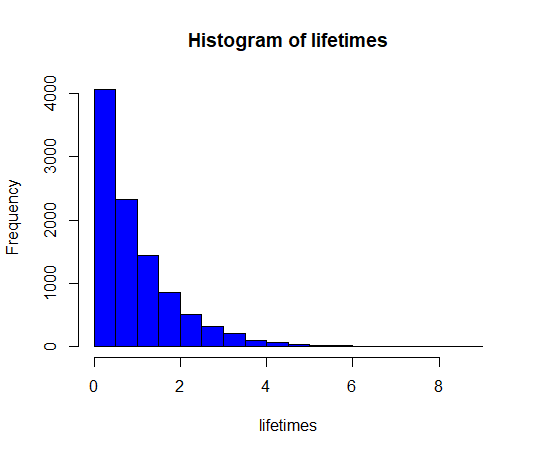

# 4 Simulation methods

## 4.1 Reliability: System lifetime

> A system consists of three components A, B and C serially connected, such that A is positioned before B, which is again positioned before C. The system will be functioning only so long as A, B and C are all functioning. The lifetime in months of the three components are assumed to follow exponential distributions with means: 2 months, 3 months and 5 months, respectively (hence there are three random variables, $X_{A}$, $X_B$ and $X_C$ with exponential distributions with $\lambda_{A}$ = 1/2, $\lambda_{B}$= 1/3 and $\lambda_{C}$= 1/5 resp.)

### a)

>  Generate, by simulation, a large number (at least 1000 – go for 10000 or 100000 if your computer is up for it) of system lifetimes (hint: consider how the random variable Y = System lifetime is a function of the three X-variables: is it the sum, the mean, the median, the minimum, the maximum, the range or something even different?).

- The lifetime can be seen as the minimal value of the three random component lifetimes

$$
\text{"Lifetime"} = min(X_A,X_B,X_C)
$$


```R
k <- 10000
xA <- rexp(k, 1/2)
xB <- rexp(k, 1/3)
xC <- rexp(k, 1/5)
x <- cbind(xA, xB, xC)
lifetimes <- apply(x,1, min)  # The second argument in apply() function, 1, means that there should be used rows (NOT columns) for finding the minimal value

```


### b)

> Estimate the mean system lifetime.

$$
\bar{x} = 0.9770395
$$


```R
> mean(lifetimes)
[1] 0.9770395
```


### c)

> Estimate the standard deviation of system lifetimes.

$$
\bar{s} = 0.9791683
$$


```R
> sd(lifetimes)
[1] 0.9791683
```


### d)

> Estimate the probability that the system fails within 1 month.

$$
P(X<1)= 0.6395
$$


```
> mean(lifetimes<1)
[1] 0.6395
```


### e)

> Estimate the median system lifetime

```
> median(lifetimes)
[1] 0.6714813
```


### f)

> Estimate the 10th percentile of system lifetimes

```R
> quantile(lifetimes, 0.1)
       10% 
0.09988259
```


### g) 

> What seems to be the distribution of system lifetimes? (histogram etc)

- It seems to be the exponential distribution



```R
hist(lifetimes, col = "blue", nclass = 30)
```

## 4.2 Basic bootstrap CI

> The following measurements were given for the cylindrical compressive strength (in MPa) for 11 prestressed concrete beams:

$$
38.43, 38.43, 38.39, 38.83, 38.45, 38.35, 38.43, 38.31, 38.32, 38.48, 38.50
$$

> 1000 bootstrap samples (each sample hence consisting of 11 measurements) were generated from these data, and the 1000 bootstrap means were arranged on order. Refer to the smallest as $\bar{x}^*_{(1)}$ , the second smallest as $\bar{x}^*_{(2)}$ and so on, with the largest being $\bar{x}^*_{(1000)}$. Assume that

$$
\bar{x}^*_{(25)} = 38.3818\\
\bar{x}^*_{(26)} = 38.3818\\
\bar{x}^*_{(50)} = 38.3909\\
\bar{x}^*_{(51)} = 38.3918\\
\bar{x}^*_{(950)} = 38.5218\\
\bar{x}^*_{(951)} = 38.5236\\
\bar{x}^*_{(975)} = 38.5382\\
\bar{x}^*_{(976)} = 38.5391\\
$$

### a) 

>  Compute a 95% bootstrap confidence interval for the mean compressive strength.

- We need to find:

$$
[q_{0.025}, q_{0.975}]
$$

- By definition 1.7

$$
q_p = (x_{(np)}+x_{(np+1}))/2
$$

- So

$$
q_{0.025} = (x_{1000*0.025}+x_{1000*0.025+1})/2 = \\
(x_{25}+ x_{26})/2 =  (38.3818 + 38.3818)/2 = 38.3818
$$

- And 

$$
q_{0.975}= (x_{1000*0.975}+x_{1000*0.975+1})/2= \\
(x_{975}+x_{976})/2= (38.5382 + 38.5391)/2 = 38.53865
$$

- The answer is that we accept that 

$$
\bar{x} \in [38.3818, 38.53865]
$$

### b) 

> Compute a 90% bootstrap confidence interval for the mean compressive strength.

- We know

$$
\alpha = 1 - \frac{90\%}{100\%} = 0.1 \\
$$

- We need to find

$$
[q_{\alpha/2}, q_{1-\alpha/2}] = [q_{0.05}, q_{0.95}]
$$

- So 

$$
q_{0.05} = (x_{50}+x_{51})/2 =   (38.3909+38.3918)/2 = 38.39135 \\
q_{0.95} = (x_{950}+x_{951})/2 = (38.5218+38.5236)/2 = 38.5227
$$

- The answer is that we accept that

$$
\bar{x} \in [38.39135, 38.5227]
$$

## 4.3 Various bootstrap CIs

> Consider the data from the exercise above. These data are entered into R as:

```R
x <- c(38.43, 38.43, 38.39, 38.83, 38.45, 38.35,
38.43, 38.31, 38.32, 38.48, 38.50)
```

> Now generate $k = 1000$ bootstrap samples and compute the 1000 means (go higher if your computer is fine with it)

### a)

> What are the 2.5%, and 97.5% quantiles (so what is the 95% confidence interval for $\mu$ without assuming any distribution)?

```R
> k <- 10000
> x <- c(38.43, 38.43, 38.39, 38.83, 38.45, 38.35,
+        38.43, 38.31, 38.32, 38.48, 38.50)
> simSamples <- replicate(k, sample(x, replace=TRUE))
> simMeans <-   apply(simSamples,2, mean)
> hist(simMeans)
> quantile(simMeans, c(0.025, 0.975))
    2.5%    97.5% 
38.38091 38.53727
```


### b) 

> Find the 95% confidence interval for $\mu$ by the parametric bootstrap assuming the normal distribution for the observations. Compare with the classical analytic approach based on the t-distribution from Chapter 2.

- Parametric distribution:

```R
> simSamples <- replicate(k,rnorm(length(x),xBar, sBar))
> simMean <- apply(simSamples, 2, mean)
> quantile(simMean, c(0.025,0.975))
    2.5%    97.5% 
38.36430 38.53135 
```


- Based on the t-distribution:

```R
> c(xBar - qt(0.975, df=length(x)-1)*sBar/sqrt(length(x)),
+   xBar + qt(0.975, df=length(x)-1)*sBar/sqrt(length(x)))
[1] 38.35250 38.54205
> t.test(x)

	One Sample t-test

data:  x
t = 903.89, df = 10, p-value < 2.2e-16
alternative hypothesis: true mean is not equal to 0
95 percent confidence interval:
 38.35250 38.54205
sample estimates:
mean of x 
 38.44727 
```


### c) 

> Find the 95% confidence interval for $\mu$ by the parametric bootstrap assuming the log-normal distribution for the observations.


```R
> logx <-log(x)
> logxMean <- mean(logx) 
> logxSd <- sd(logx)
> sim_logx <- replicate(k, rlnorm(length(logx), logxMean, logxSd))
> sim_mean <- apply(sim_logx, 2, mean)
> quantile(sim_mean, c(0.025, 0.975))
    2.5%    97.5% 
38.36428 38.53088 
```


### d)

> Find the 95% confidence interval for the lower quartile $Q_1$ by the parametric bootstrap assuming the normal distribution for the observations.

```R
> Q1 <- function(x) {quantile(x, 0.25)}
> xBar <- mean(x)
> sBar <- sd(x)
> simSamples <- replicate(k,rnorm(length(x),xBar, sBar))
> simQ1 <- apply(simSamples, 2, Q1)
> quantile(simQ1, c(0.025,0.975))
    2.5%    97.5% 
38.25936 38.46556
```


### e)

> Find the 95% confidence interval for the lower quartile $Q_1$ by the non-parametric bootstrap (so without any distributional assumptions)

```R
> simSamples <- replicate(k, sample(x, replace=TRUE))
> simQ1_nonparametric <-apply(simSamples,2, Q1)
> quantile(simQ1_nonparametric, c(0.025, 0.975))
  2.5%  97.5% 
38.315 38.430 
```


## 4.4 Two-sample TV data

>A TV producer had 20 consumers evaluate the quality of two different TV flat screens - 10 consumers for each screen. A scale from 1 (worst) up to 5 (best) were used and the following results were obtained:


| TV screen 1 | TV screen 2 |
| ----------- | ----------- |
| 1           | 3           |
| 2           | 4           |
| 1           | 2           |
| 3           | 4           |
| 2           | 2           |
| 1           | 3           |
| 2           | 2           |
| 3           | 4           |
| 1           | 3           |
| 1           | 2           |


### a)

> Compare the two means without assuming any distribution for the two samples (non-parametric bootstrap confidence interval and relevant hypothesis test interpretation).

```R
tv1 <- c(1,2,1,3,2,1,2,3,1,1)
tv2 <- c(3,4,2,4,2,3,2,4,3,2)

k <- 100000
sim_tv1 <- replicate(k, sample(tv1, replace=TRUE))
sim_tv2 <- replicate(k, sample(tv2, replace=TRUE))
means_sim_tv1 <- apply(sim_tv1, 2, mean)
means_sim_tv2 <- apply(sim_tv2, 2, mean) 
sim_dif <- means_sim_tv1 - means_sim_tv2
quantile(sim_dif, c(0.025,0.975))
	 2.5% 97.5% 
	 -1.9  -0.5
```


- If: 

$$
H_0 :\  \mu_1= \mu_2
$$


- so we reject the null hypothesis, since 0 is not included in the CI of the differences. 


### b)

> Compare the two means assuming normal distributions for the two samples without using simulations (or rather: assuming/hoping that the sample sizes are large enough to make the results approximately valid).

```r
 t.test(tv1, tv2)

	Welch Two Sample t-test

data:  tv1 and tv2
t = -3.1574, df = 17.932, p-value = 0.005468
alternative hypothesis: true difference in means is not equal to 0
95 percent confidence interval:
 -1.99869 -0.40131
sample estimates:
mean of x mean of y 
      1.7       2.9 
```

### c)

> Compare the two means assuming normal distributions for the two samples simulation based (parametric bootstrap confidence interval and relevant hypothesis test interpretation – in spite of the obviously wrong assumption).

```R
tv1 <- c(1,2,1,3,2,1,2,3,1,1)
tv2 <- c(3,4,2,4,2,3,2,4,3,2)

k <- 100000
n <- length(tv1)
sim_norm_tv1 <- replicate(k, rnorm(n, mean=mean(tv1),sd=sd(tv1) ))
sim_norm_tv2 <- replicate(k, rnorm(n, mean=mean(tv2),sd=sd(tv2) ))
means_sim_tv1 <- apply(sim_norm_tv1, 2, mean)
means_sim_tv2 <- apply(sim_norm_tv2, 2, mean) 
sim_norm_dif <- means_sim_tv1 - means_sim_tv2
quantile(sim_norm_dif, c(0.025,0.975))

      2.5%      97.5% 
-1.9371878 -0.4560157 

```

- We reject the null hypothesis of $\mu_1=\mu_2$


## 4.5 Non-linear error propagation

> The pressure $P$, and the volume $V$ of one mole of an ideal gas are related by the equation $PV = 8.31T$, when $P$ is measured in kilopascals, $T$ is measured in kelvins, and $V$ is measured in liters.


### a)

> Assume that $P$ is measured to be $240.48 kPa$ and $V$ to be $9.987 L$ with known measurement errors (given as standard deviations): $0.03 kPa$ and$ 0.002 L$. Estimate $T$ and find the uncertainty in the estimate.

We know:
$$
PV = 8.31T\\
T  = \frac{PV}{8.31}
$$
Estimate $T$:
$$
\hat{T} = 240.48*9.987 / 8.31 = 289.0101
$$


Differentiate the function with respect to both p and v:

$$
f(p,v) = \frac{pv}{8.31} \\
\frac{\partial f}{\partial p} = \frac{1*p^0v}{8.31}=\frac{v}{8.31} \\
    \frac{\partial f}{\partial v} = \frac{p*1*v^0}{8.31} = \frac{p}{8.31} \\
$$


Calculate the uncertainty:

$$
\sigma^2_{\hat{T}} = \left(\frac{\partial f}{\partial p}\right)^2*\sigma^2_p+\left(\frac{\partial f}{\partial v}\right)^2*\sigma^2_v = \\
    \frac{v^2}{8.31^2} * \sigma^2_p + \frac{p^2}{8.31^2}*\sigma^2_v  =\\
    9.987^2/8.31^2*0.03^2+240.48^2/8.31^2*0.002^2 = 0.3210887 \\
$$

So the uncertainty is:

$$
 \sigma_{\hat{T}} = \sqrt{0.3210887} = 0.06818855
$$


### b)

> Assume that $P$ is measured to be $240.48kPa$ and $T$ to be $289.12K$ with known measurement errors (given as standard deviations): $0.03kPa$ and $0.02K$. Estimate $V$ and find the uncertainty in the estimate.

We know:
$$
V = \frac{8.31T}{P}\\
$$
Estimate
$$
\hat{V} = 8.31*289.12/240.48= 9.990798
$$


Differentiate the function with respect to both p and v:
$$
f(p,v) = \frac{8.31t}{p} \\
\frac{\partial f}{\partial t} = \frac{1*t^0*8.31}{p}=\frac{8.31}{p} \\
    \frac{\partial f}{\partial p} = 8.31t*-1*p^{-1-1} =- \frac{8.31t}{p^2} \\
$$

 Calculate the uncertainty: 
$$
\sigma^2_{\hat{V}} = \left(\frac{\partial f}{\partial t}\right)^2*\sigma^2_t+\left(\frac{\partial f}{\partial p}\right)^2*\sigma^2_p = \\
    \frac{8.31^2}{p^2} * \sigma^2_t + \left( -\frac{8.31*t}{p^2}\sigma_p \right)^2 =\\
    8.31^2/240.48^2*0.02^2 + (- 8.31*289.12/240.48^2*0.03)^2= 0.001425149 ^2\\
$$

So the uncertainty is:
$$
\sigma_{\hat{T}} = \sqrt{0.001425149 ^2} = 0.001425149
$$


### c)

> Assume that $V$ is measured to be $9.987 L$ and $T$ to be $289.12 K$ with known measurement errors (given as standard deviations): $0.002 L$ and $0.02 K$. Estimate P and find the uncertainty in the estimate.

We know:

$$
P = \frac{8.31T}{V}\\
$$

Estimate $P$:

$$
\hat{P} = 8.31*289.12/9.987 = 240.5715
$$

Differentiate the function with respect to both t and v:

$$
f(t,v) = \frac{8.31t}{v} \\
\frac{\partial f}{\partial t} = \frac{1*t^0*8.31}{v}=\frac{8.31}{v} \\
    \frac{\partial f}{\partial v} = 8.31t*-1*v^{-1-1} =- \frac{8.31t}{v^2} \\
$$

 Calculate the uncertainty: 

$$
\sigma^2_{\hat{P}} = \left(\frac{\partial f}{\partial t}\right)^2*\sigma^2_t+\left(\frac{\partial f}{\partial v}\right)^2*\sigma^2_v = \\
    \frac{8.31^2}{v^2} * \sigma^2_t + \left( -\frac{8.31*t}{v^2}\sigma_v \right)^2 =\\
    8.31^2/9.987^2*0.02^2 + (- 8.31*289.12/9.987^2*0.002)^2= 0.00259796\\
$$

So the uncertainty is:

$$
\sigma_{\hat{T}} = \sqrt{0.00259796} = 0.05097019
$$


### d)

> Try to answer one or more of these questions by simulation (assume that the errors are normally distributed).


Let's do simulations in order to estimate $P$ and find the the uncertainty in the estimate, where: 
$$
P = \frac{8.31T}{V}\\
$$

```R
> n <- 10000
> Ts <- rnorm(n, mean= 289.12, sd = 0.02)
> Vs <- rnorm(n, mean= 9.987, sd = 0.002)
> p <- 8.31*Ts/Vs
> mean(p)
[1] 240.5706
> sd(p)
[1] 0.05104125
```


