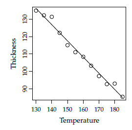

# Simple Linear Regression

## 5.1 Plastic film folding machine

> On a machine that folds plastic film the temperature may be varied in the range of 130-185 °C. For obtaining, if possible, a model for the influence of temperature on the folding thickness, n = 12 related set of values of temperature and the fold thickness were measured that is illustrated in the following figure:



### a)

> Determine by looking at the figure, which of the following sets of estimates for the parameters in the usual regression model is correct:

1. $\hat{\beta_0}=0$, $\hat{\beta_1}=-0.9$, $\hat{\sigma}=36$ 
2. $\hat{\beta_0}=0$, $\hat{\beta_1}=0.9$, $\hat{\sigma}=3.6$
3. $\hat{\beta_0}=252$, $\hat{\beta_1}=-0.9$, $\hat{\sigma}=3.6$
4. $\hat{\beta_0}=-252$, $\hat{\beta_1}=-0.9$, $\hat{\sigma}=36$
5. $\hat{\beta_0}=252$, $\hat{\beta_1}=-0.9$, $\hat{\sigma}=36$


- The only possible intercept  $\beta_0$ among the ones given in the answers is 252, because the line continues to ascend to the left, and it must cross y-axis somewhere above 130. 
- The slope estimate of -0.9 in these two options looks reasonable, because the line goes downward.
- The estimated standard deviation of the error $s_e =\hat{\sigma}$ is 3.6, because from the figure it is clear that the points are NOT having an average vertical distance to the line in the size of 36.
- So **the answer is 3.** 

### b)

> What is the only possible correct answer:

1. The proportion of explained variation is 50% and the correlation is 0.98
2. The proportion of explained variation is 0% and the correlation is -0.98
3. The proportion of explained variation is 96% and the correlation is -1
4. The proportion of explained variation is 96% and the correlation is 0.98
5. The proportion of explained variation is 96% and the correlation is -0.98


+ The proportion of variation explained must be pretty high, because the observations are pretty close to the line. That means that 96% of total variation is explained by the line.  
+ Answer 1 and 4 are ruled out since the correlation clearly is negative. 
+ This also narrows the possibilities down to answer 3 and 5. 
+ And since the correlation is NOT exactly -1 (in which case the observations would be exactly on the line), the correct **answer is: 5**


## 5.2 Linear regression life time model

> A company manufactures an electronic device to be used in a very wide temperature range. The company knows that increased temperature shortens the life time of the device, and a study is therefore performed in which the life time is determined as a function of temperature. The following data is found:

| Temperature in Celsius (t) | Life time in hours(y) |
| -------------------------- | --------------------- |
| 10                         | 420                   |
| 20                         | 365                   |
| 30                         | 285                   |
| 40                         | 220                   |
| 50                         | 176                   |
| 60                         | 117                   |
| 70                         | 69                    |
| 80                         | 34                    |
| 90                         | 5                     |

### a)

> Calculate the 95% confidence interval for the slope in the usual linear regression model, which expresses the life time as a linear function of the temperature.


- By using the linear regression model

$$
Y_i = \beta_0 + \beta_1 t_i+ \epsilon_i\text{ , } \epsilon_i \sim N(0,\sigma^2_{\epsilon})\text{, } i = 1,...,5
$$

```R
t <-c(10,20,30,40,50,60,70,80,90)
y <-c(420,365,285,220,176,117,69,34,5)
tbar <- mean(t)
ybar <- mean(y)

# Find parameter estimates
Sxx <- sum((t-tbar)^2)
beta1hat <- sum((t-tbar)*(y-ybar))/Sxx
beta0hat <- ybar - beta1hat*tbar

# Find the error variance estimate
e <- y - (beta0hat + beta1hat*t)
sigmahat <- sqrt(sum(e^2)/(length(t)-2)) 

# Find the standart error for the slope
sigmabeta1 <- sqrt(sigmahat^2/Sxx)
sigmabeta1
# Find CI for the slope (Method 5.15)
c( beta1hat - qt((1-0.05/2), df=length(t)-2)*sigmabeta1, 
beta1hat + qt((1-0.05/2), df=length(t)-2)*sigmabeta1
)
		
	-5.918161 -4.708505

```

- So the answer is that we accept $\beta_1 \in [-5.918161 -4.708505]$ 


### b)

> Can a relation between temperature and life time be documented on level 5%?

- By the method 5.14

1. 

$$
H_{01}\ :\ \beta_1= 0 \\
H_{11}\ :\ \beta_1\ne 0
$$


2. 

$$
t_{obs, \beta_{1}} =   -20.77291 \\
$$


3. 

$$
\text{p-value}_{1} = 1.505039*10^{-7}
$$

4. 

- $\text{p-value}_1$  is less than $\alpha = 0.05$, so we reject $H_{01}$ 


```r
tobsbeta1 <- beta1hat/sigmabeta1
pvalue1 <- 2*(1 - pt(abs(tobsbeta1), df=length(t)-2 ))
```

## 5.3 Yield of chemical process

> The yield y of a chemical process is a random variable whose value is considered to be a linear function of the temperature x. The following data of corresponding values of x and y is found:


| Temperature in °C (x) | Yield in grams(y) |
| --------------------- | ----------------- |
| 0                     | 14                |
| 25                    | 38                |
| 50                    | 54                |
| 75                    | 76                |
| 100                   | 95                |

The average and standard deviation of temperature and yield are
$$
\bar{x} = 50 , \ s_x = 39.52847, \bar{y}=55.4, s_y=31.66702 s_y=31.66702
$$

In the exercise the usual linear regression model is used

$$
Y_i = \beta_0 + \beta_1 X_i+ \epsilon_i\text{ , } \epsilon_i \sim N(0,\sigma^2_{\epsilon})\text{, } i = 1,...,5
$$

### a)

> Can a significant relationship between yield and temperature be documented on the usual significance level $\alpha = 0.05$?

- In R output P-value of the slope is only  $6.27*10^{-5}$ that is less than $0.05$. So we can conclude that there is a significant relationship between yield and temperature

### b) 

> Give the 95% confidence interval of the expected yield at a temperature of $x_{new}= 80 °C$.

- By method 5.18

$$
\hat\beta_0+\hat\beta_1x_{new}\pm t_{1-\alpha/2} \hat\sigma \sqrt{\frac{1}{n}+\frac{(x_{new}-\bar{x})^2}{S_{xx}}}
$$

```R
x <- c(0,25,50,75,100)
y <- c(14,38,54,76,95)
fit <- lm( y ~ x)

alpha <- 0.05
xnew <- 80
# By method 5.18
res <- coef(fit)[1]+ coef(fit)[2]*xnew 
range <- qt((1-alpha/2),df=length(x)-2)*sigma(fit)*sqrt(1/length(x)+(xnew-mean(x))^2/sum((x-mean(x))^2))

c(res-range, res+range)
 75.79348    83.00652 

# By using predict function
predict(fit, newdata=data.frame(x=xnew), interval="confidence", level=1-alpha)
fit  lwr   upr
79.4 75.79 83.01
```

- Thus the answer is $[75.79,83.01]$


### c)

> What is the upper quartile of the residuals?

Upper quantile = $Q_3$ = $q_{0.75}$
$$
pn= 0.75*5 = 3.75
$$
$pn$ is not an integer, so we take "next one" in the list, that is 4. 


```R
> sort(fit$residuals)[4]
  4 
0.6 
```

- Thus the answer is: 0.6 


## 5.4 Plastic material

> In the manufacturing of a plastic material, it is believed that the cooling time has an influence on the impact strength. Therefore a study is carried out in which plastic material impact strength is determined for 4 different cooling times. The results of this experiment are shown in the following table:


| Cooling times in seconds(x) | Impact strength in $kJ/m^2$ (y) |
| --------------------------- | ------------------------------- |
| 15                          | 42.1                            |
| 25                          | 36.0                            |
| 35                          | 31.8                            |
| 40                          | 28.7                            |

The following statistics may by used:
$$
\bar{x} = 28.75,\  \bar{y}=34.65,\ S_{xx}=368.75
$$

### a) 

> What is the 95% confidence interval for the slope of the regression model, expressing the impact strength as a linear function of the cooling time?

```R
x <- c(15,25,35,40)
y <- c(42.1,36.0,31.8,28.7)
xbar <- 28.75
ybar <- 34.65
Sxx <- 368.75
fit <- lm(y~x)
out <- summary(fit)
beta1hat <- coef(fit)[2]
sigmabeta1 <- out$coefficients[2, 2]
c( beta1hat - qt((1-0.05/2), df=length(x)-2)*sigmabeta1, 
   beta1hat + qt((1-0.05/2), df=length(x)-2)*sigmabeta1
)
	-0.6460407 -0.3966711 
```

- So the answer is that we accept $\beta_1 \in [-0.6460407, -0.3966711]$ 


### b) 

> Can you conclude that there is a relation between the impact strength and the cooling time at significance level $\alpha$ = 5%?


```R
pvalue1 <- out$coefficients[2,4]
0.003075239

```

- $\text{p-value}_1$  is less than $\alpha = 0.05$, so we can conclude that there is a relation between the impact strength and the cooling time. In other words, the relation is statically significant. 


### c)

> For a similar plastic material the tabulated value for the linear relation between temperature and impact strength (i.e the slope) is -0.30. If the following hypothesis is tested (at level $\alpha$ = 0.05)

$$
H_0: \beta_1 = -0.30 \\
H_1: \beta_1 \ne -0.30
$$

> with the usual t-test statistic for such a test, what is the range (for t) within which the hypothesis is accepted?


```R
alpha <- 0.05
c(qt(alpha/2, df=2),qt(1-alpha/2, df=2))
	-4.302653  4.302653
```

- The critical values for the t-statistic with ν = 2 degrees of freedom is

$$
[-4.302653,  4.302653]
$$

## 5.5 Water pollution

> In a study of pollution in a water stream, the concentration of pollution is measured at 5 different locations. The locations are at different distances to the pollution source. In the table below, these distances and the average pollution are given:


| Distance to the pollution source(km) | Average concentration |
| ------------------------------------ | --------------------- |
| 2                                    | 11.5                  |
| 4                                    | 10.2                  |
| 6                                    | 10.3                  |
| 8                                    | 9.68                  |
| 10                                   | 9.32                  |

### a)

> What are the parameter estimates for the three unknown parameters in the usual linear regression model: 1) The intercept ($\beta_0$), 2) the slope ($\beta_1$) and 3) error standard deviation ($\sigma$)?

```R
distances <-c(2,4,6,8,10)
concentrations <- c(11.5, 10.2, 10.3, 9.68, 9.32)
fit <- lm(concentrations ~ distances)
out <- summary(fit)
beta0hat <- coef(fit)[1]
	11.664 
beta1hat <- coef(fit)[2]
	-0.244
sigmahat <- sigma(fit)
	0.348023
```

$$
\hat\beta_0 = 11.664 \\
\hat\beta_1 = -0.244 \\
\hat\sigma = 0.348023
$$


### b)

> How large a part of the variation in concentration can be explained by the distance?

```R
out$r.squared
 0.8676188
```

$$
R^2 = 0.8676188
$$

- Note that this is only an estimate. 


### c)

> What is a 95%-confidence interval for the expected pollution concentration 7 km from the pollution source?

```R
predict(fit, newdata=data.frame(distances=dnew), interval="confidence", level=1-alpha)
    fit      lwr      upr
1 9.956 9.430636 10.48136
```

- The answer:

$$
[9.430636, 10.48136]
$$

## 5.6 Membrane pressure drop

> When purifying drinking water you can use a so-called membrane filtration. In an experiment one wishes to examine the relationship between the pressure drop across a membrane and the flux (flow per area) through the membrane. We observe the following 10 related values of pressure (x) and flux (y):

|      | Pressure(x) | Flux(y) |
| ---- | ----------- | ------- |
| 1    | 1.02        | 1.15    |
| 2    | 2.08        | 0.85    |
| 3    | 2.89        | 1.56    |
| 4    | 4.01        | 1.72    |
| 5    | 5.32        | 4.32    |
| 6    | 5.83        | 5.07    |
| 7    | 7.26        | 5.00    |
| 8    | 7.96        | 5.31    |
| 9    | 9.11        | 6.17    |
| 10   | 9.99        | 7.04    |

### a) 

> What is the empirical correlation between pressure and flux estimated to? Give also an interpretation of the correlation.


```R
cor(D$pressure, D$flux)
[1] 0.9638184
```


$$
\hat\rho = r = 0.964
$$

- This means that flux increase with increasing pressure. 

###  b) 

> What is a 90% confidence interval for the slope $\beta_1$ in the usual regression model?


```R
alpha <- 0.1
beta1hat <- coef(fit)[2]
sigmabeta1 <- out$coefficients[2, 2]
c( beta1hat - qt((1-alpha/2), df=out$df[2])*sigmabeta1, 
   beta1hat + qt((1-alpha/2), df=out$df[2])*sigmabeta1
)
	0.5911094 0.8538426
```

- So the answer is that we accept $\beta_1 \in [0.5911094, 0.8538426]$

### c)

> How large a part of the flux-variation $\sum\limits_{i=1}^{10}(y_i-\bar{y})^2$ is not explained by pressure differences?


```R
1 - cor(D$pressure, D$flux)^2
 	0.07105402
```


### d)

> Can you at significance level $\alpha$ = 0.05 reject the hypothesis that the line passes through (0, 0)?


The intercept should be equals to 0, if the line passes through (0,0). This means that if we can reject that the intercept equals to 0, so we can reject that the line passes through (0, 0).  Therefore we formulate the null hypothesis and the alternative hypothesis as follows:
$$
H_{00}: \ \beta_0=0 \\
H_{01} : \ \beta_0 \ne 0
$$

```R
pvalue0 <- out$coefficients[1,4]
	0.6806967
```


$ \text{p-value}_0=0.68$ is higher than $\alpha=0.05$, so we need to accept that the line passes through (0, 0). 


### e)

> A confidence interval for the line at three different pressure levels: $x_{new}^A= 3.5$, $x^B_{new}=5.0$ and  , $x^C_{new}=9.5$ will look as follows:

$$
\hat\beta_0+\beta_1*x^U_{new}\pm C_U
$$

>  where $U$ then is either $A$, $B$ or $C$. Write the constants $C_U$ in increasing order.


```R
alpha <- 0.05
xnews <- c(3.5,5.0, 9.5)

CIs <- predict(fit, newdata=data.frame(pressure=xnews), interval="confidence", level=1-alpha)
constants <- numeric(3)

for (i in 1:3){
  constants[i] <- CIs[i,3]-CIs[i,1]  
}
constants
	0.4647513 0.3858058 0.6429206
```


$$
C_A = 0.4647513 \\
C_B = 0.3858058 \\ 
C_C = 0.6429206
$$

- This gives that:

$$
C_B < C_A < C_C
$$


- It can also be calculated without R as follows:

By Method 5.18 constants differs only by this term: $(x_{new}-\bar{x})^2$ 

So since $\bar{x}=5.547$:
$$
(5.0-5.547)^2<(3.5-5.547)^2<(9.5-5.547)^2 \\
(x^B_{new}-5.547)^2<(x^A_{new}-5.547)^2<(x^C_{new}-5.547)^2 \\
C_B<C_A<C_C
$$


