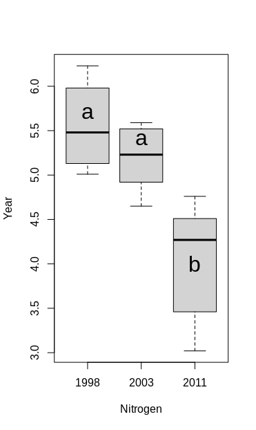

# Grouped Data (one-way ANOVA)


## 8.1 Environment action plans

> To investigate the effect of two recent national Danish aquatic environment action plans the concentration of nitrogen (measured in g/m 3 ) have been measured in a particular river just before the national action plans were enforced (1998 and 2003) and in 2011. Each measurement is repeated 6 times during a short stretch of river. The result is shown in the following table:


|      | $N_{1998}$ | $N_{2003}$ | $N_{2011}$ |
| ---- | ---- | ---- | ---- |
||5.01 |5.59 |3.02|
||6.23| 5.13| 4.76|
||5.98| 5.33| 3.46|
||5.31| 4.65| 4.12|
||5.13| 5.52 |4.51|
||5.65| 4.92 |4.42|
| **Row mean** | 5.5517 | 5.1900 | 4.0483 |
| **Row variances** | 0.2365767 | 0.1313200| 0.4532967 |

> Further, the total variation in the data is SST = 11.4944. You got the following output from R corresponding to a one-way analysis of variance (where most of the information, however, is replaced by the letters A-E as well as U and V):

```R
> anova(lm(N ~ Year))
Analysis of Variance Table
Response: N
			Df 		SumSq 		MeanSq 		Fvalue 		Pr(>F)
Year 		A=2 	B=7.3884 	C=3.6942 	U=13.4825   V=0.00045
Residuals 	D=15 	4.1060 		E=0.274
```


### a)  

> What numbers did the letters A-D substitute?

**A:** Treatment degree of freedom

$$
(k-1)= 3-1=2
$$

**B:** Treatment sum of squares
$$
SS(Tr) = SST - SSE = 11.4944 - 4.1060= 7.3884
$$

**C:** Treatment mean square 
$$
MS(Tr) = \frac{SS(Tr)}{k-1} = \frac{7.3884}{2}=3.6942
$$
**D**: Residual degree of freedom
$$
(n-k)  = 18-3 = 15
$$
**E**: Residual mean square
$$
MSE = \frac{SSE}{n-k} = \frac{4.1060}{15} = 0.274
$$

### b)

> If you use the significance level $\alpha=0.05$, what critical value should be used for the hypothesis test carried out in the analysis (and in the table illustrated with the figures U and V)?

**Critical value:**
$$
F_{1-\alpha} = F_{0.95}(2,15) = 3.682
$$

```R
> qf(0.95, df1=2, df2=15)
[1] 3.68232
```

**U**: The test statistics 
$$
F_{obs}=\frac{MS(Tr)}{MSE} = 13.48248
$$

```R
> F <- 3.6942 / 0.274
[1] 13.48248
```

**V:** p-value
$$
P(F>F_{obs}) = 0.00045
$$

```R
> pvalue <- 1-pf(F, df1=2, df2=15)
[1] 0.0004456902
```


### c)

> Can you with these data demonstrate statistically significant (at significance level $\alpha=0.05$) differences in N-mean values from year to year (both conclusion and argument must be valid)?

Yes, because the calculated $\text{p-value}=0.00045$ is less than $\alpha=0.05$ 


### d)

> Compute the 90% confidence interval for the single mean difference between year 2011 and year 1998.

By method 8.9 Post hoc pairwise confidence intervals

$$
\bar{y}_{2011} - \bar{y}_{1998} \pm t_{1-\alpha/2}\sqrt{MSE(\frac{1}{n_i}+\frac{1}{n_j})}  = [-2.03,-0.97]
$$

```R
>  4.0483 - 5.5517 + c(-1,1) * qt((1-0.1/2), 15) * sqrt(0.274*(1/6+1/6))
[1] -2.0331965 -0.9736035
```


## 8.2 Environment action plans (part 2)

> This exercise is using the same data as the previous exercise, but let us repeat the description here. To investigate the effect of two recent national Danish aquatic environment action plans the concentration of nitrogen (measured in g/m 3 ) have been measured in a particular river just before the national action plans were enforced (1998 and 2003) and in 2011. Each measurement is repeated 6 times during a short stretch of river. The data can be read into R  and the means and variances computed by the following in R:

```R
nitrogen <- c(5.01, 5.59, 3.02,
6.23, 5.13, 4.76,
5.98, 5.33, 3.46,
5.31, 4.65, 4.12,
5.13, 5.52, 4.51,
5.65, 4.92, 4.42)
year <- factor(rep(c("1998", "2003", "2011"), 6))
tapply(nitrogen, year, mean)
1998 2003 2011
5.552 5.190 4.048
tapply(nitrogen, year, var)
1998 2003
2011
0.2366 0.1313 0.4533
mean(nitrogen)
[1] 4.93
```

### a)

> Compute the three sums of squares ($SST$, $SS(Tr)$ and $SSE$) using the three means and three variances, and the overall mean (show the formulas explicitly).


$$
SST = \sum_{i=1}^k{}\sum_{j=1}^{n_i}({y_{ij}-\bar{y}})^2 =  11.4944
$$

```R
>  SST <- sum((nitrogen-mean(nitrogen))^2)
[1] 11.4944
```


$$
SS(Tr) = \sum_{i=1}^{k}n_i(\bar{y}_i-\bar{y})^2=7.388433
$$

```R
> alpha <- tapply(nitrogen, year, mean) - mean(nitrogen)
> SSTr <- 6*sum(alpha^2)
[1] 7.388433
```


$$
SSE = \sum_{i=1}^k{}\sum_{j=1}^{n_i}({y_{ij}-\bar{y}_i})^2 = 4.105967
$$

```R
> sum_SSE_each <- function(x){return(sum((x-mean(x))^2))}
> SSE <-  sum(tapply(nitrogen, year, sum_SSE_each))
[1] 4.105967
```


### b) 

> Find the $SST$-value in R using the sample variance function `var`

$$
SST=(n-1)*s^2_y
$$

```R
> SST <- (length(nitrogen)-1)*(var(nitrogen))
[1] 11.4944
```


### c)

> Run the ANOVA in R and produce the ANOVA table in R


```R
> anova(lm(nitrogen ~ year))
Analysis of Variance Table

Response: nitrogen
          Df Sum Sq Mean Sq F value    Pr(>F)    
year       2 7.3884  3.6942  13.496 0.0004436 ***
Residuals 15 4.1060  0.2737                      
---
Signif. codes:  0 ‘***’ 0.001 ‘**’ 0.01 ‘*’ 0.05 ‘.’ 0.1 ‘ ’ 1
```


### d)

> Do a complete post hoc analysis, where all the 3 years are compared pairwise.

We have the same number of observation in each treatment group, there is going to be used Least Significant Difference(LSD) in order to perform post hoc analysis. 

$$
M=k*(k-1)/2=3*(3-1)/2=3 \\ 
\alpha_{Bonferroni} = \alpha / M = 0.05/3= 0.0167 \\
LSD_{\alpha_{Bonferroni}}=t_{1-\alpha_{Bonferroni}/2}*\sqrt{2*MSE/m} = 0.8136401
$$

```R
> LSD <- qt(1-alpha_bonferroni/2, df=length(nitrogen)-length(unique(year)))*sqrt(2*0.2737/ 6)
[1] 0.8136401
```

**Compact letter display**

| Year | Mean   |      |
| ---- | ------ | ---- |
| 1998 | 5.5517 | a    |
| 2003 | 5.1900 | a    |
| 2011 | 4.0483 | b    |

**Box plot**

```R
> plot(year, nitrogen, xlab="Nitrogen", ylab="Year")
> text(1:3, c(5.7, 5.4, 4), c("a", "a", "b"), cex=2)
```




**Conclusion:**  from the compact letter display and the box plot we can see that the level in 1998 and 2003 are not significantly different, but the nitrogen level in 2011 is significantly smaller than in 2003 and 1998.

### e)

> Use R to do model validation by residual analysis.

```R
library(MESS)
qqwrap <- function(x, y, ...){
  stdy <- (y-mean(y))/sd(y)
  qqnorm(stdy, main="", ...)
  qqline(stdy)}
wallyplot(lm(nitrogen~year)$residuals, FUN=qqwrap, ylim=c(-3,3))
```


**Conclusion:** from the Wally plot we can see that there appears to be no important deviation from normality


## 8.3 Plastic film 

> A company is starting a production of a new type of patch. For the product a thin plastic film is to be used. Samples of products were received from 5 possible suppliers. Each sample consisted of 20 measurements of the film thickness and the following data were found:


|            | Average film thickness<br/>x̄ in μm | Sample standard deviation<br/>s in μm |
| ---------- | ---------------------------------- | ------------------------------------- |
| Supplier 1 | 31.4                               | 1.9                                   |
| Supplier 2 | 30.6                               | 1.6                                   |
| Supplier 3 | 30.5                               | 2.2                                   |
| Supplier 4 | 31.3                               | 1.8                                   |
| Supplier 5 | 29.2                               | 2.2                                   |


> From the usual calculations for a one-way analysis of variance the following is obtained:


| Source       | Degrees of freedom | Sums of Squares |
| ------------ | ------------------ | --------------- |
| **Supplier** | 4                  | SS ( Tr ) = 62  |
| **Error**    | 95                 | SS ( Tr ) = 62  |


### a)

> Is there a significant (α = 5%) difference between the mean film thicknesses for the suppliers (both conclusion and argument must be correct)?


There is a significant difference between the mean film thicknesses for the suppliers, because the $\text{p-value}=0.004$ is smaller than $\alpha=0.05$ 

```R
> df1 <- 4
> df2 <- 95
> SSTr <- 62
> SSE <- 362.71
> F <- (SSTr/df1)/(SSE/df2)
> pv <- 1-pf(F, df1=df1, df2=df2)
> pv
[1] 0.004407421
```


### b)

> Compute a 95% confidence interval for the difference in mean film thicknesses of Supplier 1 and Supplier 4 (considered as a “single pre-planned” comparison).


By the method 8.9


$$
\bar{y}_{1} - \bar{y}_{4} \pm t_{1-\alpha/2}\sqrt{MSE(\frac{1}{n_i}+\frac{1}{n_j})}  = [ -1.126686,  1.326686]
$$

```R
> df2 <- 95
> mean1 <- 31.4
> mean4 <- 31.3
> MSE <- 362.71/df2
> n1 <- 20
> n4 <-20
> mean1 - mean4 + c(-1,1) * qt((1-0.05/2), df2) * sqrt(MSE*(1/n1+1/n4))
[1] -1.126686  1.326686
```


## 8.4 Brass alloys

> When brass is used in a production, the modulus of elasticity, E, of the material is often important for the functionality. The modulus of elasticity for 6 different brass alloys are measured. 5 samples from each alloy are tested. The results are shown in the table below where the measured modulus of elasticity is given in GPa:

| M1   | M2   | M3    | M4   | M5   | M6   |
| ---- | ---- | ----- | ---- | ---- | ---- |
| 82.5 | 82.7 | 92.2  | 96.5 | 88.9 | 75.6 |
| 83.7 | 81.9 | 106.8 | 93.8 | 89.2 | 78.1 |
| 80.9 | 78.9 | 104.6 | 92.1 | 94.2 | 92.2 |
| 95.2 | 83.6 | 94.5  | 87.4 | 91.4 | 87.3 |
| 80.8 | 78.6 | 100.7 | 89.6 | 90.1 | 83.8 |

> In an R-run for one way analysis of variance and the following output is obtained: (however some of the values have been substituted by the symbols A, B, and C)

```R
> anova( lm(elasmodul ~ alloy) )
Analysis of Variance Table
Response: elasmodul
			Df 	Sum Sq 	Mean Sq F value Pr(>F)
alloy 		A 	1192.51 238.501 9.9446 3.007e-05
Residuals 	B 	C 		23.983
```

### a)

> What are the values of A, B, and C?


**A:** Treatment degree of freedom
$$
(k-1)= 6-1=5
$$

**B**: Residual degree of freedom
$$
(n-k)  = 30-6 = 24
$$

**C**: Residual sum of squares
$$
SSE = MSE*(n-k) = 575.592
$$

```R
> MSE <- 23.983
> df2 <- 24
> SSE <- MSE * df2
> SSE
[1] 575.592
```


### b)

> The assumptions for using the one-way analysis of variance is (choose the answer that lists all the assumptions and that NOT lists any unnecessary assumptions):

1. The data must be normally and independently distributed within each group and the variances within each group should not differ significantly from each other
2. The data must be normally and independently distributed within each group
3. The data must be normally and independently distributed and have approximately the same mean and variance within each group
4. The data should not bee too large or too small
5. The data must be normally and independently distributed within each group and have approximately the same IQR-value in each group

**Correct answer: 1)**


### c)

> Compute a 95% confidence interval for the single pre-planned difference between brass alloy 1 and 2.


$$
\bar{y}_{1} - \bar{y}_{2} \pm t_{1-\alpha/2}\sqrt{MSE(\frac{1}{n_i}+\frac{1}{n_j})}  = [ -2.912491,  9.872491]
$$


```R
> df2 <- 24
> mean1 <- mean(c(82.5,83.7,80.9,95.2,80.8))
> mean2 <- mean(c(82.7,81.9,78.9,83.6,78.6))
> MSE <- 23.983
> n1 <- 5
> n2 <-5
> mean1 - mean2 + c(-1,1) * qt((1-0.05/2), df2) * sqrt(MSE*(1/n1+1/n2))
[1] -2.912491  9.872491
```

